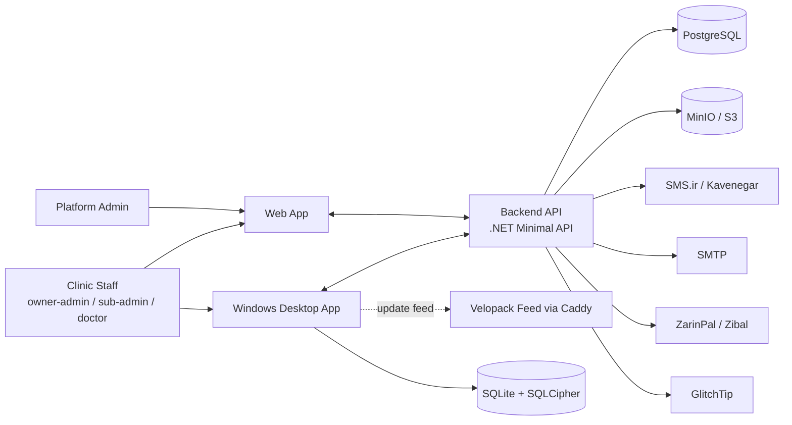

## Contract

Decides: who/what interacts with Animora, which external systems exist, and the measurable
quality targets the whole architecture is judged against. Does not decide module design (see
[04](04-module-catalog.md)) or data design (see [07](07-server-data-architecture.md)).

## System context

## Actors

| Actor | Description | Primary client |
|---|---|---|
| Owner-admin | Primary tenant account, full permissions | Desktop, Web |
| Sub-admin / staff role | Scoped permission set within a tenant | Desktop, Web |
| Doctor | Clinical staff with appointment/medical-file access | Desktop, Web |
| Groomer / service staff | Non-medical appointment resource | Desktop, Web |
| Client (pet owner) | Not a system login; a managed record only | n/a |
| Platform admin | Genspark-side operator managing tenants/subscriptions/backups | Web (back-office) |

## External systems

| System | Role | Failure posture |
|---|---|---|
| SMS.ir (primary), Kavenegar (failover) | SMS notifications | Failover on primary error/timeout; delivery status logged; see [14](14-jobs-and-notifications.md) |
| SMTP (MailKit) | Email receipts, invoices, password reset | Retried via Hangfire; never blocks request path |
| ZarinPal (primary), Zibal (fallback) | Payment capture for subscriptions | Idempotent server-side verify; no client-trusted state |
| S3-compatible (MinIO now) | Attachment storage | Single source of truth for binaries; never local app paths |
| GlitchTip (self-hosted) | Error tracking | Best-effort; app never depends on it being reachable |
| Uptime Kuma | External health polling | Read-only observer of `/health/ready` |
| Velopack feed (self-hosted via Caddy) | Desktop auto-update | Desktop keeps working fully offline if unreachable |

## Quality attributes (measurable)

| Attribute | Target | Notes |
|---|---|---|
| Desktop cold start | ≤ 3 s to interactive shell on a 5-year-old dual-core laptop | See [12](12-desktop-architecture.md) |
| API p95 latency (non-report endpoints) | ≤ 200 ms under nominal load on the 2 vCPU/4 GB VPS | Excludes cold cache first hit |
| Report/analytics endpoint p95 | ≤ 1.5 s | Backed by materialized views, see [16](16-reporting-and-analytics.md) |
| Server memory ceiling per container | api ≤ 700 MB, postgres ≤ 1.5 GB, minio ≤ 400 MB, web ≤ 300 MB, caddy ≤ 100 MB (see [19](19-deployment-topology.md)) | Sum must leave headroom on 4 GB host |
| Offline duration (desktop) | Fully functional, zero degradation, for ≥ 14 days with no server contact | Beyond 14 days: license grace, see [11](11-licensing-and-entitlements.md) |
| Sync convergence | A device offline ≤ 30 days re-seeds and converges within one batch cycle (see [09](09-sync-architecture.md)) with zero silent data loss | Beyond 30 days: forced full re-seed |
| Sync batch apply | Transactional per batch; a crash mid-batch leaves zero partial state (see SYNC-R-09) | |
| Desktop DB growth | Prunable/archivable without breaking FTS5 or reports at 5 years of a mid-size clinic's data | See [08](08-desktop-local-data.md) |
| API version compatibility | Server supports the current and N-1 desktop protocol/API version at all times | See [06](06-api-contract.md) |
| Concurrent tenants on one VPS | ≥ 50 small clinics with acceptable p95 | Drives pagination, caching, indexing posture |

## Constraints

| Constraint | Source | Implication |
|---|---|---|
| Single weak VPS (2 vCPU/4 GB) hosts everything today | TECH_STACK §1, §15 | Aggressive caching, capped worker concurrency, no heavy per-request compute |
| Single backend, single API contract, no per-client business logic | TECH_STACK §1 | Desktop and web are both thin clients of the same domain logic |
| Desktop must be fully usable for days with zero internet | Product scope §3 | Local SQLite is a first-class write store, not a cache |
| Iran market: no Sentry SaaS, no Firebase/Vercel/AWS managed services, unreliable registries | TECH_STACK §13, §19 | Self-hosted equivalents only; local package/image caches in CI |
| No true auto-recurring billing (gateway limitation) | TECH_STACK §9 | Fixed-term subscription + renewal/dunning jobs, not subscriptions-as-a-service billing loops |
| Tax/e-invoicing integration explicitly out of scope | TECH_STACK §19 | Invoicing module has no Samane Moadian hook, ever |
| Topology A -> B split must be config-only | Product scope §4, TECH_STACK §15 | Every affected setting enumerated in [19](19-deployment-topology.md) env-var table |
| Old desktop builds (shipped months ago) must keep syncing | TECH_STACK §3, §8 | N-1 API/protocol compatibility is not optional |

## Non-goals (see TECH_STACK §19 for the authoritative list)

Tax/e-invoicing, DICOM/PACS imaging, telemedicine video, native mobile apps, ML/AI diagnostics,
multi-currency, marketplace/e-commerce, third-party public API program.
