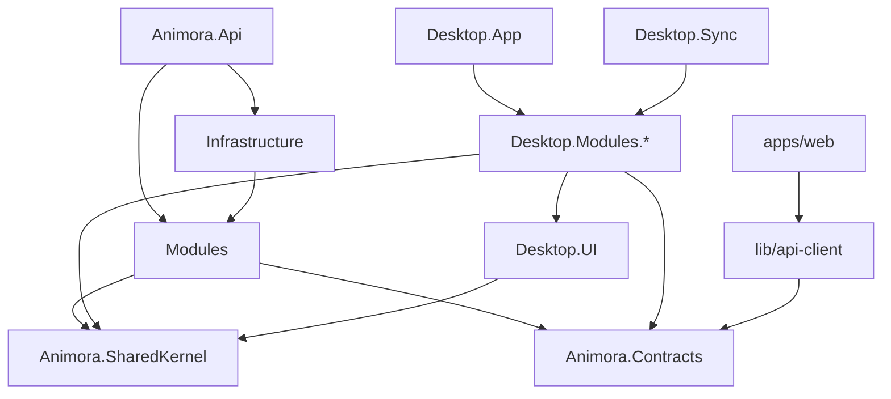

## Contract

Decides: the physical repository/project/assembly layout for backend, desktop, and web, the allowed
dependency directions, and how those directions are mechanically enforced. Does not decide what
each module contains (see [04](04-module-catalog.md)) or database schema (see [07](07-server-data-architecture.md)).

## Repository layout (platform-scoped roots)

One top-level directory per platform, so a task on one platform never requires reading another
(agent context discipline, see `AGENTS.md`):

```
contracts/          # platform-neutral wire artifacts: openapi/, enums/, errors/, sync/
shared/dotnet/      # Animora.SharedKernel, Animora.Contracts (backend + desktop, single source)
desktop/            # Avalonia Windows client:  src/, tests/
backend/            # ASP.NET Core modular monolith: src/, tests/
web/                # Next.js workspace: apps/, packages/
infra/              # compose, caddy, postgres, minio, backup, env templates
tools/              # codegen/ (Kiota, Orval), scripts/
```

Repo-root `Directory.Build.props` / `Directory.Packages.props` apply to every .NET project
(`desktop/`, `backend/`, `shared/`): single TFM, nullable, central package version pinning.

## Backend solution (.NET, modular monolith — INV-01)

```
backend/
  src/
    Animora.Api/                # ASP.NET Core Minimal API host, composition root, DI wiring
    Modules/
      Animora.Modules.Identity/         # users, roles, permissions, auth
      Animora.Modules.Clients/          # owners, patients (animals), medical file
      Animora.Modules.Visits/           # visits, biometrics, lab results, attachments links
      Animora.Modules.Scheduling/       # appointments, resources, calendar, reminders-due computation
      Animora.Modules.Finance/          # ledger, invoices, cheques, cash sessions, expenses/income
      Animora.Modules.Reporting/        # read models, KPI queries, exports
      Animora.Modules.Notifications/    # notification engine, channels, delivery log
      Animora.Modules.Licensing/        # plans, entitlements, license tokens, payments
      Animora.Modules.Files/            # attachment metadata, S3 orchestration
      Animora.Modules.Sync/             # sync protocol endpoints, cursors, batch apply
      Animora.Modules.PlatformAdmin/    # back-office: tenants, subscriptions, backups
    Animora.Infrastructure/     # EF Core DbContext(s), Npgsql, Dapper connection factory, S3 client
  tests/
    Animora.ArchTests/          # NetArchTest rules (this document, enforced)
    Animora.UnitTests/
    Animora.IntegrationTests/   # Testcontainers: Postgres, MinIO
    Animora.SyncTests/          # mandatory sync matrix, see 09
shared/dotnet/
    Animora.Contracts/          # OpenAPI-derived shared DTOs/enums, versioned, no logic
    Animora.SharedKernel/       # Cross-module primitives: TenantId, Money, Result, HLC, base entity
```

Each `Modules.*` project uses the same internal folder shape: `Contract/` (public in-process
contract + Mediator types), `Domain/`, `Application/` (handlers, validators), `Data/Writes` (EF
Core), `Data/Queries` (Dapper), `Endpoints/`, `Configuration/` (module DI) — the split that makes
AT-03/AT-04/AT-05 mechanically checkable.

Each `Modules.*` project exposes exactly one `I<Module>Contract` interface (public in-process
contract) plus its `Mediator` request/notification types; internal types are `internal`.

## Desktop solution (.NET, Avalonia)

```
desktop/
  src/
    Animora.Desktop.App/        # Avalonia App, composition root, navigation shell, startup
    Animora.Desktop.UI/         # design tokens, shared controls/converters, ViewModelBase (leaf)
    Animora.Desktop.Modules.*/  # mirrors backend module names; Views + ViewModels + local handlers
    Animora.Desktop.Data/       # SQLite DbContext (EF Core writes), Dapper read queries, SQLCipher
    Animora.Desktop.Sync/       # outbox, cursor store, batch client, conflict application
    Animora.Desktop.Infrastructure/ # Kiota generated API client, Serilog, Velopack, printing
  tests/
    Animora.Desktop.UnitTests/  # handlers, validators, formatters
    Animora.Desktop.UiTests/    # Avalonia.Headless RTL smoke test per screen
    Animora.Desktop.ArchTests/  # NetArchTest rules for desktop assemblies (DIR-05, DIR-07)
```

Desktop modules cover `Identity`, `Clients`, `Visits`, `Scheduling`, `Finance`, `Reporting`,
`Notifications`, `Licensing`, `Files`; `PlatformAdmin` is a web-only back-office and has no desktop
counterpart. `Animora.SharedKernel` and `Animora.Contracts` are consumed from `shared/dotnet/`, not
duplicated.

`Animora.SharedKernel` and `Animora.Contracts` are shared source, not duplicated logic (INV-02):
desktop and backend both consume the OpenAPI-generated `Animora.Contracts` package; validation
rules (`FluentValidation`) are authored once in `Animora.SharedKernel.Validation` and referenced by
both backend and desktop projects.

## Web workspace (Next.js)

```
web/
  apps/web/
    app/
      (marketing)/               # SSG/ISR public pages
      (app)/                     # authenticated app, client+server components
      (admin)/                   # platform back-office
    lib/
      api-client/                # generated: openapi-typescript + Orval hooks
      auth/                      # session/token handling
      offline/                   # Dexie cache + Serwist service worker
      i18n/                      # next-intl setup (messages/ holds fa, en)
    components/
    styles/
  packages/
    ui/                          # shared shadcn/ui-based components, RTL tokens
    config/                      # shared biome/tailwind/ts config
```

## Allowed dependency directions



Rules:

- **DIR-01**: `Modules.*` MUST NOT reference another `Modules.*` project directly. Cross-module
  calls go through `Mediator` requests defined in the target module's public contract namespace.
- **DIR-02**: `SharedKernel` and `Contracts` MUST NOT reference any `Modules.*` project (leaf
  dependency only).
- **DIR-03**: `Infrastructure` MAY be referenced by `Modules.*` only through interfaces the module
  defines; `Modules.*` MUST NOT reference concrete `Npgsql`/`EF Core` provider types directly outside
  its own `*.Data` sub-namespace.
- **DIR-04**: `Animora.Api` is the only project allowed to reference every `Modules.*` project (for
  DI registration and endpoint mapping).
- **DIR-05**: Desktop `*.Modules.*` MUST NOT reference `Animora.Api` or any backend-only project;
  the only shared code path is `SharedKernel` + `Contracts`.
- **DIR-06**: `apps/web` MUST NOT hand-write API DTOs; all wire types come from `lib/api-client`
  (generated). No module in `apps/web` imports another feature's server actions directly except
  through `lib/api-client` or shared `packages/ui`.
- **DIR-07**: `Animora.Desktop.UI` is a leaf design-system assembly: it MUST NOT reference any
  `Desktop.Modules.*`, `Desktop.Data`, `Desktop.Sync`, or `Desktop.Infrastructure` project. It exists
  so DESK-ARCH-12's shared token/resource dictionary is reachable by every module without coupling
  modules to the shell or to each other.

## NetArchTest-expressible rules (enforced in `Animora.ArchTests`, desktop rules in `Animora.Desktop.ArchTests`)

| Rule ID | Expressed as | Maps to |
|---|---|---|
| AT-01 | Types in `Modules.X` must not have a dependency on `Modules.Y` for any Y != X | DIR-01, INV-01 |
| AT-02 | Types in `SharedKernel`/`Contracts` must not depend on any `Modules.*` namespace | DIR-02 |
| AT-03 | Types outside `*.Data` sub-namespace must not depend on `Npgsql`/`Microsoft.EntityFrameworkCore` types directly | DIR-03, INV-20 |
| AT-04 | Types under `*.Reporting`/`*.Queries` (hot report paths) must not depend on `Microsoft.EntityFrameworkCore` | INV-20 |
| AT-05 | Types under `*.Data.Writes` must not depend on `Dapper` | INV-20 |
| AT-06 | Only `Animora.Api` may reference more than one `Modules.*` assembly | DIR-04 |
| AT-07 | Synced entity classes (marked with `ISyncedEntity`) must not expose a public setter for their primary key | INV-03 |
| AT-08 | Types in `Animora.Desktop.UI` must not depend on any `Animora.Desktop.*` namespace other than `UI` | DIR-07 |
| AT-09 | Types in `Desktop.Modules.*` must not depend on `Animora.Desktop.App` or on another `Desktop.Modules.*` | DIR-01, DIR-05 |

## Where generated clients land

| Generator | Input | Output location |
|---|---|---|
| Kiota | `contracts/openapi/v1` | `desktop/src/Animora.Desktop.Infrastructure/Generated/` |
| openapi-typescript + Orval | `contracts/openapi/v1` | `web/apps/web/lib/api-client/generated/` |

Generation scripts live in `tools/codegen/`. `contracts/openapi/snapshots/` holds the frozen spec
snapshots the breaking-change gate compares against (API-VER-05).

Generated code is committed (deterministic, reviewable diff) and regenerated by a CI check that
fails the build if the spec and generated output drift (see [06](06-api-contract.md)).
