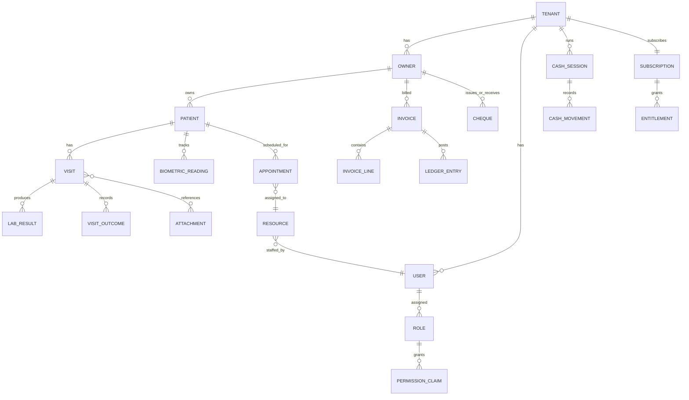
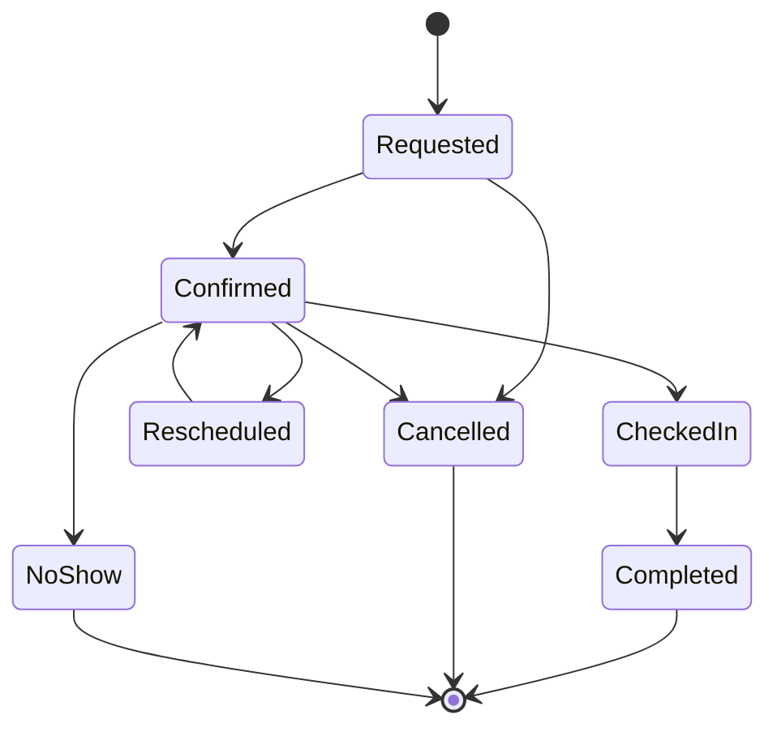
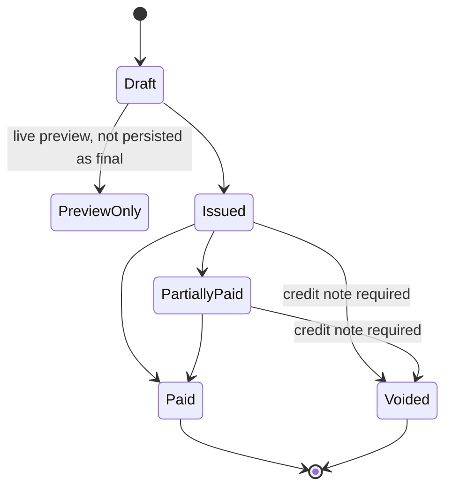
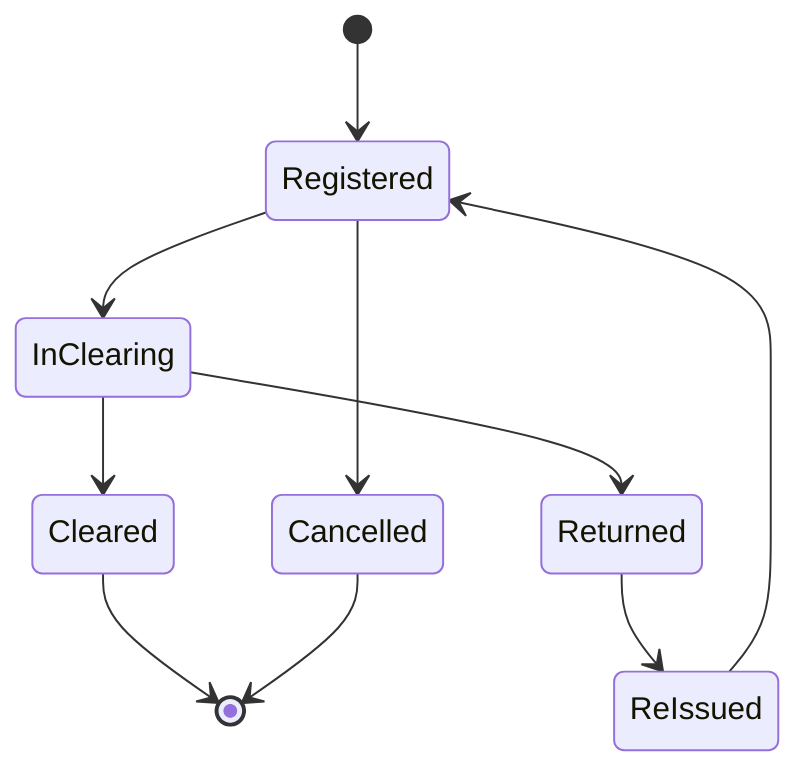
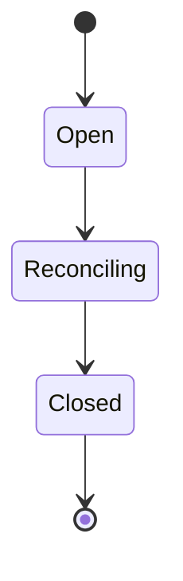
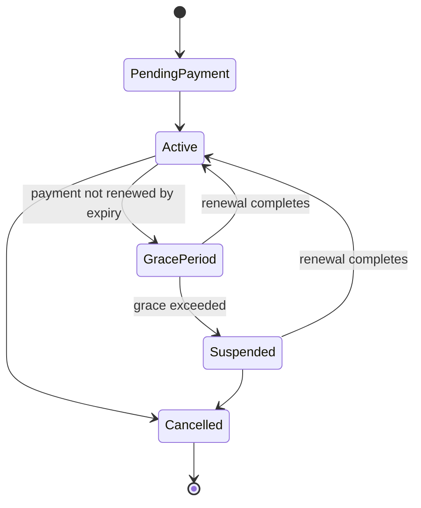

## Contract

Decides: aggregate boundaries, entity ownership, the ER map, tenant/identity scoping rules, and
the lifecycle state machines for entities that have one. Does not decide table/column/index design
(see [07](07-server-data-architecture.md)) or SQLite mirroring (see [08](08-desktop-local-data.md)).

## Tenant and identity scoping

- Every domain entity except platform-level records (`Plan`, global `PermissionClaim` catalog)
  carries `TenantId` (UUIDv7). This is DOM-01.
- `TenantId` is resolved once per request from the authenticated principal and flows through
  `Mediator` requests as ambient context, never as a client-suppliable body field (DOM-02) —
  enforced together with RLS, see [10-security-and-access-control.md#tenant-isolation](10-security-and-access-control.md).
- A `Patient` belongs to exactly one `Owner`, who belongs to exactly one tenant. Cross-tenant
  references are structurally impossible (no FK crosses a tenant boundary) — DOM-03.
- `Device` (desktop installs) and `User` (staff logins) are both scoped to one tenant; a person
  working at two clinics needs two accounts (DOM-04, deliberate simplicity; see
  [_meta/open-questions.md](_meta/open-questions.md) if reconsidered).

## Aggregates

| Aggregate root | Members | Boundary rule |
|---|---|---|
| Owner | Owner, contact info | Patients reference Owner by id; Owner does not load Patients as part of its own consistency boundary |
| Patient | Patient, MedicalFile header | Visits, biometrics, lab results reference Patient by id but are separate aggregates (append-heavy, high volume) |
| Visit | Visit, VisitOutcome, BiometricReading (per-visit), LabResult (per-visit) | One transaction per visit write; attachments referenced by id, not embedded |
| Appointment | Appointment, resource assignment | One aggregate per booking; recurring series is a separate `AppointmentSeries` referenced by id, not embedded |
| Invoice | Invoice header, InvoiceLine[] | Immutable once issued (see state machine below); LedgerEntry postings are a separate aggregate linked by id (INV-06) |
| LedgerEntry | Single append-only row | Never part of another aggregate's transaction boundary; always its own insert |
| Cheque | Cheque | Independent aggregate; may reference an Invoice or Expense by id, never embeds them |
| CashSession | CashSession, CashMovement[] | One open session per till at a time per tenant (DOM-05) |
| Subscription | Subscription, Entitlement snapshot | Owned by Licensing; referenced, never copied, by other modules |

## Entity relationship map

## Key domain invariants (DOM-xx)

| ID | Rule |
|---|---|
| DOM-01 | Every tenant-scoped entity carries a non-null `TenantId`. |
| DOM-02 | `TenantId` is never accepted from request bodies; it is derived from the authenticated context. |
| DOM-03 | No foreign key crosses a `TenantId` boundary. |
| DOM-04 | One `User` account belongs to exactly one tenant. |
| DOM-05 | At most one open `CashSession` exists per till (resource) per tenant at any time. |
| DOM-06 | An `Invoice` in `Issued` or later state is immutable; corrections happen via a linked `CreditNote`, never by editing the original (see [15](15-finance-and-ledger.md)). |
| DOM-07 | A `Cheque` transitions only along the defined state machine; `Returned` is terminal and requires a linked reason code. |
| DOM-08 | Appointment double-booking on the same `Resource` for overlapping time ranges is rejected at write time (server-side check; desktop performs the same check locally offline and both sides re-validate on sync). |
| DOM-09 | `BiometricReading` values are immutable once recorded; corrections are new readings with a `supersedes` link, never edits (parallels ledger immutability for clinical trust). |

## Lifecycle state machines

### Appointment

`NoShow` triggers a follow-up alert source (see [14](14-jobs-and-notifications.md)). `Rescheduled`
preserves the original `Appointment` id (time/resource fields change; history kept via audit log,
not a new row) to keep sync simple (single-row LWW field-group).

### Invoice

`Draft` is the only mutable state and is not synced as a financial fact — it is a working copy.
`Issued` triggers the immutable-ledger posting (INV-06). `Voided` never deletes; it links a
`CreditNote` ledger posting (see [15](15-finance-and-ledger.md)).

### Cheque

`Returned` requires a mandatory `returnReasonCode` and raises the `cheque-returned` alert source.

### Cash session

DOM-05 is enforced at `Open`; a second `Open` request for the same till is rejected with
`ERR-FINANCE-CASH-ALREADY-OPEN` (see [21](21-conventions.md) error taxonomy).

### Subscription

See [11-licensing-and-entitlements.md](11-licensing-and-entitlements.md) for the offline-desktop
counterpart of this state machine (heartbeat/grace token states).

## Entities per module (ownership summary)

See [04-module-catalog.md](04-module-catalog.md) "Owned entities" column for the authoritative
per-module list; this file defines their relationships and invariants, not their existence.
