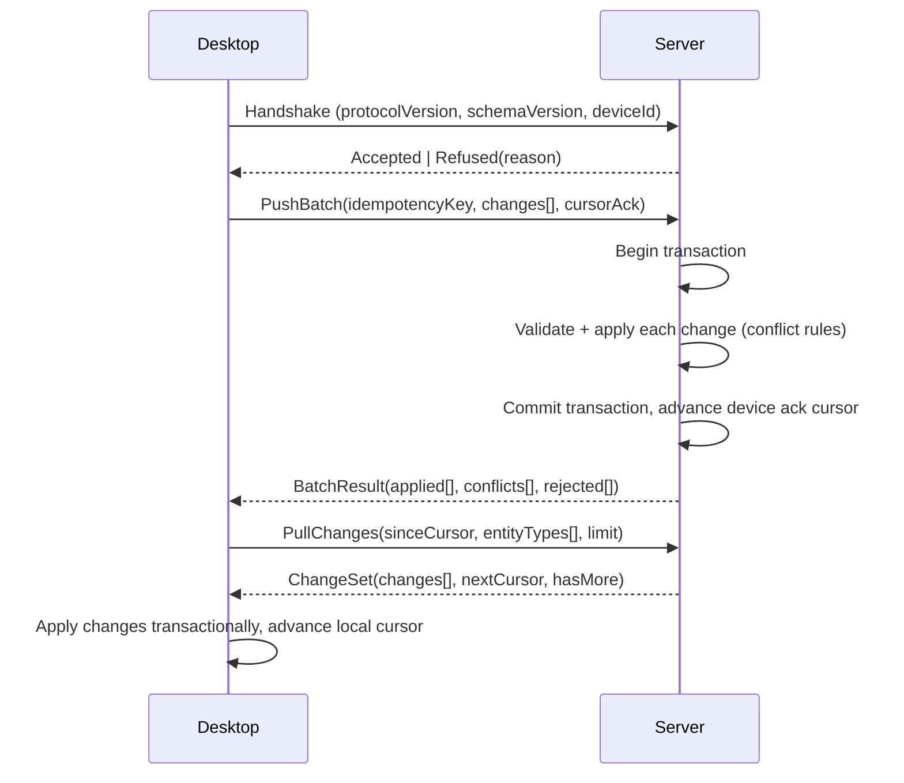

## Contract

Decides: the complete offline-first sync engine — change capture, ordering, batching, conflict
resolution, attachment sync, failure semantics, and the mandatory test matrix. This is the single
home for all sync behavior; other docs link here rather than restating any rule. Does not decide
entity shape (see [05](05-domain-model.md)) or storage schema (see [07](07-server-data-architecture.md),
[08](08-desktop-local-data.md)).

## Sync entity classes

Every synced entity declares exactly one class, fixed at design time (INV-14):

| Class | Conflict rule | Examples |
|---|---|---|
| `MutableLWW` | Field-group Last-Write-Wins by HLC | Patient, Owner, Appointment, MedicalFile header |
| `AppendOnly` | No update ever accepted after create; conflicts are structurally impossible | LedgerEntry, BiometricReading, AuditLog entry |
| `StateMachine` | LWW on non-status fields; status transitions validated against the entity's state machine ([05](05-domain-model.md)) at apply time, invalid transition rejected not merged | Invoice, Cheque, CashSession, Subscription |
| `ReferenceOnly` | Server-authoritative, pulled read-only by desktop, never pushed | Plan, PermissionClaim catalog |

SYNC-R-01: An entity's class MUST be declared in its `Animora.Contracts` definition and cannot
change without a protocol version bump.

## Change capture

- Every write to a `MutableLWW`/`StateMachine`/`AppendOnly` entity, on either side, stamps
  `hlc_timestamp` (Hybrid Logical Clock: `(physicalTime, logicalCounter, nodeId)`) at the moment of
  commit — SYNC-R-02.
- Field-group versioning: entities are divided into named field groups (e.g., Patient:
  `identity{name,species,breed}`, `contact{ownerPhoneOverride}`, `clinicalFlags{allergies}`).
  Each group carries its own HLC so two devices editing different groups of the same record both
  win without clobbering each other — SYNC-R-03. Field-group definitions live in
  `Animora.Contracts` per entity, not duplicated in this doc.
- Desktop change capture is trigger-based in SQLite (row marked `is_dirty=1` with its HLC on
  write); server change capture is transactional-outbox-based (the same unit of work that commits
  the domain change also inserts a `sync_outbox` row) — SYNC-R-04.

## Cursors

- Each device holds one cursor per entity type (`sync_cursor` table, [08](08-desktop-local-data.md)),
  representing the last server change it has fully applied — SYNC-R-05.
- The server holds, per device, the last acknowledged push batch id, to detect replays and gaps
  — SYNC-R-06.
- Cursors are monotonic server-assigned sequence-like tokens (opaque to the client), not wall-clock
  timestamps, so clock skew cannot desynchronize pull progress — SYNC-R-07.

## Protocol negotiation

- Every sync session opens with a handshake: client sends `protocolVersion`, `schemaVersion`
  (desktop build's EF Core migration level), `deviceId`, `tenantId` — SYNC-R-08.
- Server compares `protocolVersion` against its supported range (current and N-1, matching API
  policy in [06](06-api-contract.md)). Mismatch below N-1 -> server refuses the session with
  `ERR-SYNC-PROTOCOL-OBSOLETE` and the client shows a forced-update prompt; it does not attempt a
  partial or degraded sync (TECH_STACK §8) — SYNC-R-09.
- Server compares `schemaVersion` similarly: a desktop build whose local schema predates a
  breaking server-side entity change is refused sync with `ERR-SYNC-SCHEMA-OBSOLETE` rather than
  risk corrupting server data (TECH_STACK §8) — SYNC-R-10.

## Batch protocol

- Wire format: `MessagePack` + Brotli (TECH_STACK §8), over the same versioned REST contract as
  the rest of the API — SYNC-R-11.
- Batch size and payload are capped (server-configured, exposed via a capability response in the
  handshake) — SYNC-R-12. Server applies backpressure with `429 Retry-After` if capacity is tight
  on the 4 GB host; the client backs off exponentially and never spins — SYNC-R-13.
- Batch apply is transactional per batch (SYNC-R-14): either every change in the batch commits, or
  none do. A crash mid-batch on the server rolls back cleanly; the client, having not received a
  `BatchResult`, retries the same batch using the same `idempotencyKey`, and the server's
  idempotency-key store returns the original (already-applied or rolled-back-and-now-reapplied)
  result rather than double-applying — SYNC-R-15.
- On the client, a crash mid-apply of a pulled `ChangeSet` is safe because the local apply is also
  one SQLite transaction; on restart the client resumes from the last durably advanced
  `sync_cursor` — SYNC-R-16.

## Conflict rules per entity class

- `MutableLWW`: for each field group independently, the change with the higher HLC wins; a losing
  change is recorded in `conflict_log` (server) with both versions for support visibility, but is
  silently superseded for the user — no merge UI (SYNC-R-17). Rationale: clinic data fields rarely
  collide at field-group granularity in practice; a merge UI is not worth its complexity budget on
  this stack (see ADR-0001).
- `AppendOnly`: a duplicate insert (same id, replayed) is detected by primary key and treated as a
  no-op success (idempotent), never a conflict — SYNC-R-18. A genuine second write with a new id is
  simply another row; there is no "conflict" concept for append-only data by construction.
- `StateMachine`: the incoming change's target status is validated against the current
  server-side status using the entity's state machine ([05](05-domain-model.md)). A valid forward
  transition applies; an invalid one (e.g., two devices both trying to move the same `CashSession`
  from `Open` to a different terminal state) is rejected for the losing write with
  `ERR-SYNC-INVALID-TRANSITION`, logged to `conflict_log`, and surfaced to the losing device's user
  for manual re-action — SYNC-R-19. Non-status fields on the same entity still resolve by
  field-group LWW.
- Money-adjacent `StateMachine`/`AppendOnly` entities never accept a client-supplied ledger
  posting directly; the server re-derives the ledger effect of a state transition itself
  (idempotently, keyed by entity id + transition) so a replayed or conflicting client message can
  never double-post money — SYNC-R-20 (see [15](15-finance-and-ledger.md)).

## Tombstones and re-seed

- Deleting a synced entity anywhere creates a tombstone (INV-04) carrying an HLC, which propagates
  like any other change — SYNC-R-21.
- Tombstones are retained server-side for a fixed retention window (default: 90 days) after which
  they are physically purged — SYNC-R-22.
- If a device's cursor is older than the tombstone retention window (long offline absence beyond
  the [01](01-context-and-drivers.md) convergence target), the server refuses an incremental pull
  with `ERR-SYNC-CURSOR-TOO-OLD` and instead offers a full re-seed: a fresh full snapshot pull that
  replaces the device's entire local dataset for that tenant — SYNC-R-23. Re-seed preserves
  not-yet-acknowledged outbox rows (they are replayed as a push after re-seed completes) so no
  local-only work in flight is lost — SYNC-R-24.

## Attachment sync

- Attachment metadata (see [17](17-files-and-attachments.md)) is a `MutableLWW`-classed synced
  entity and follows the normal batch protocol — SYNC-R-25.
- Binary content streams separately, chunked and resumable, in the background with a priority
  queue (small/recent first) — SYNC-R-26; correctness of the domain sync never depends on binary
  content having arrived (a patient record is fully usable with a "photo pending download"
  placeholder).

## Dead-letter and re-seed for the outbox

- A local outbox entry that fails validation on the server N times (configurable, default 5) is
  marked dead-letter, surfaced in the desktop UI with the rejection reason, and excluded from
  further automatic retry until the user acts on it — SYNC-R-27 (TECH_STACK §8).
- Dead-letter entries never silently disappear; they require explicit user dismissal or correction
  (edit-and-resubmit creates a new outbox row).

## Failure and crash semantics (summary table)

| Failure point | Behavior |
|---|---|
| Network drop mid-handshake | No state changed either side; client retries handshake on next timer tick |
| Network drop mid-push | Server never committed (transactional, SYNC-R-14); client retries with same idempotency key (SYNC-R-15) |
| Network drop mid-pull | Client never advanced cursor; retries `PullChanges` from the same `sinceCursor` |
| Server crash mid-batch apply | Transaction rolls back atomically; client retry is safe (idempotent) |
| Client crash mid-apply of pulled changes | Local transaction rolls back; cursor not advanced; resumes cleanly |
| Clock skew / tampered device clock | HLC logical counter and server-side offset detection bound the impact on ordering; large skew triggers license clock-tamper signal (never affects data ordering correctness) — see [11](11-licensing-and-entitlements.md) |
| Replayed push (duplicate network retry) | Idempotency key + per-entity id/HLC comparison makes replay a no-op |
| Protocol/schema version mismatch | Refused outright (SYNC-R-09, SYNC-R-10), no partial sync attempted |
| Cursor older than retention | Forced full re-seed (SYNC-R-23) |
| Multi-device concurrent edit, same field group | Field-group LWW resolves deterministically; loser logged (SYNC-R-17) |

## Ordering guarantees

- Within one device's outbox, changes to the same entity apply in local commit order
  (SYNC-R-28) — the outbox is FIFO per entity id.
- Across devices, there is no global total order; convergence relies on HLC comparison at
  apply-time, not arrival order (SYNC-R-29) — this is what makes the system correct despite network
  reordering and retries.
- Pull `ChangeSet`s are applied by the client in the order the server emits them; the server emits
  them in server-commit order per entity type, which is sufficient because cross-entity referential
  order is enforced by the server refusing to emit a child change before its parent has been synced
  to that device (dependency-aware pull ordering) — SYNC-R-30.

## Security of the sync channel

- Sync endpoints require the same bearer-token authentication as the rest of the API (see
  [10](10-security-and-access-control.md)); there is no separate trust mechanism — SYNC-R-31.
- Batch payloads are transport-encrypted (TLS 1.3) like all API traffic; `MessagePack`+Brotli is a
  wire-efficiency format, not a security control — SYNC-R-32.
- A device's sync scope is restricted to its own tenant by the same RLS/tenant-context mechanism as
  any other request (INV-08); a compromised device credential cannot pull another tenant's data
  — SYNC-R-33.
- Revoked devices (see [10](10-security-and-access-control.md) device/session revocation) are
  rejected at the handshake step before any data is exchanged — SYNC-R-34.

## Mandatory sync test matrix (TECH_STACK §16)

Every synced entity addition MUST have a passing case for each row before merge (INV-19):

| Case | Verifies |
|---|---|
| Conflict resolution (same field group, two devices) | SYNC-R-17 deterministic winner |
| Conflict resolution (different field groups, two devices) | SYNC-R-03 both survive |
| Duplicate/replayed push | SYNC-R-15/SYNC-R-18 idempotency |
| Crash mid-batch (server) | SYNC-R-14 atomic rollback |
| Crash mid-apply (client) | SYNC-R-16 atomic rollback |
| Clock skew between devices | SYNC-R-02/SYNC-R-29 HLC still orders correctly |
| Partial sync (network cut mid-stream) | Resume from cursor, no duplication, no loss |
| Tombstone propagation | INV-04, SYNC-R-21 delete reaches all devices |
| Re-seed after cursor too old | SYNC-R-23/SYNC-R-24 full snapshot + outbox replay |
| Protocol-version mismatch | SYNC-R-09 refusal, no partial application |
| Schema-version mismatch | SYNC-R-10 refusal |
| Large attachment resume | SYNC-R-26 chunked resume after interruption |
| Multi-device convergence (3+ devices, mixed online/offline) | End-to-end convergence within target ([01](01-context-and-drivers.md)) |
| Invalid state transition race (StateMachine class) | SYNC-R-19 rejection + conflict log |
| Money non-double-posting under conflicting replay | SYNC-R-20 |

This matrix is implemented in `Animora.SyncTests` ([03](03-solution-structure.md)) using
Testcontainers for the server side and an in-memory/temp-file SQLite for the client side.
