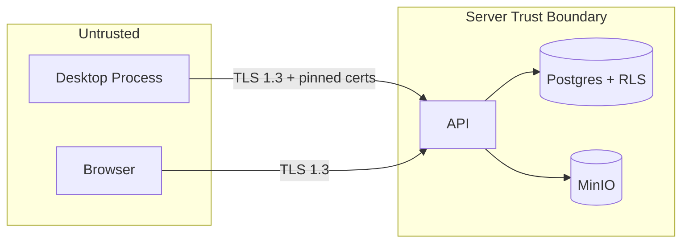

## Contract

Decides: trust boundaries, authentication flows for web and desktop, the RBAC/permission model,
tenant-isolation defense-in-depth, desktop-at-rest security, the audit chain design, and the threat
model. Does not decide licensing/entitlement token mechanics (see [11](11-licensing-and-entitlements.md),
which is a distinct concern from authN/authZ).

## Trust boundaries

SEC-01: No business rule, permission decision, or entitlement check is trusted from a client
process; the desktop and browser are both untrusted input sources. SEC-02: the local SQLite store
is part of the untrusted zone even though it holds decrypted-at-rest data during app runtime —
compromise of a desktop device exposes only that device's tenant data, never other tenants'.

## AuthN flows

### Web

1. Credential login (`ASP.NET Core Identity`, `Argon2id` hashing) issues a short-lived access
   token + rotating refresh token (SEC-03).
2. Access token: JWT, carries `tenantId`, `userId`, permission claims snapshot, short TTL (minutes).
3. Refresh token: opaque, stored server-side with rotation-on-use and reuse detection — a reused
   (already-rotated) refresh token immediately revokes the entire token family (SEC-04).
4. Tokens are never stored in `localStorage` (TECH_STACK §18); web uses httpOnly, secure,
   `SameSite=Strict` cookies for the refresh token, with the access token held in memory only
   (SEC-05).

### Desktop

1. Same credential login endpoint; desktop additionally registers a `Device` record (device
   fingerprint, see [11](11-licensing-and-entitlements.md)) at first login (SEC-06).
2. Refresh token persisted via DPAPI-protected local storage, not the SQLite domain database
   (SEC-07) — a stolen database file alone cannot yield a live session.
3. Desktop can operate fully offline once it holds a valid entitlement snapshot (see
   [11](11-licensing-and-entitlements.md)); expired access tokens block only server-mediated calls
   (sync, payment, notifications), never local CRUD (INV-15).

### Session/device revocation

- SEC-08: a revoked device or refresh-token family is rejected at the next token-refresh attempt
  and at the next sync handshake (SYNC-R-34); there is no instant push-revocation channel (would
  require the device to be online, contradicting the offline-first promise) — the containment
  window is bounded by access-token TTL.

## RBAC model

- Roles are tenant-defined (owner-admin creates roles) composed of a fixed platform-defined
  catalog of permission claims (SEC-09) — roles are a named bundle, not a new claim type.
- Every user has exactly one primary role plus zero or more supplementary permission grants for
  edge cases (e.g., a doctor temporarily granted a finance view) — SEC-10.
- The `owner-admin` role is system-seeded per tenant at signup and cannot be deleted or stripped of
  the `tenant.manage-staff` claim (prevents tenant lockout) — SEC-11.

## Permission claim catalog (grouped by module)

| Module | Example claims |
|---|---|
| Identity | `staff.manage`, `roles.manage` |
| Clients | `owners.read`, `owners.write`, `patients.read`, `patients.write`, `medical-file.read` |
| Visits | `visits.write`, `lab-results.write`, `biometrics.write` |
| Scheduling | `appointments.write`, `resources.manage`, `calendar.read-all` (vs own-schedule-only) |
| Finance | `invoices.issue`, `invoices.void` (PERM-INVOICE-VOID), `cheques.manage`, `cash-session.open`, `cash-session.close`, `expenses.manage` |
| Reporting | `reports.view-basic`, `reports.view-advanced` (entitlement-gated, see [11](11-licensing-and-entitlements.md)) |
| Licensing | `subscription.manage` (owner-admin only in practice) |
| PlatformAdmin | `platform.tenants.manage`, `platform.backups.view` (platform-level, not tenant RBAC) |

Full enumerated list lives in the permission-claim seed data, not duplicated here (INV-18); this
table is the canonical grouping reference.

- SEC-12: every endpoint declares its required claim(s) in its OpenAPI operation metadata; a
  missing declaration fails a CI lint (enforces INV-09).

## Tenant isolation defense-in-depth

| Layer | Mechanism |
|---|---|
| Network/request | `TenantId` derived from authenticated principal only (DOM-02) |
| ORM | EF Core global query filter per `DbContext` (DATA-04) |
| Database | PostgreSQL RLS (INV-08, DATA-03) |
| Storage | S3 key prefix per tenant (see [17](17-files-and-attachments.md)) |
| Sync | Device-to-tenant binding checked every handshake (SYNC-R-33) |
| Testing | Mandatory Testcontainers RLS suite (TECH_STACK §16) |

## Desktop-at-rest security

- SQLCipher-encrypted SQLite (TECH_STACK §4), key lifecycle per [08-desktop-local-data.md#sqlcipher-key-lifecycle](08-desktop-local-data.md).
- Local secrets (refresh token, license token cache) stored via DPAPI, never in the SQLite file or
  plaintext config (SEC-13).
- Application binaries are Authenticode-signed; licensing code paths carry lightweight obfuscation
  as a deterrent, explicitly not a sole control (TECH_STACK §9, see
  [11-licensing-and-entitlements.md#anti-tamper-posture-and-limits](11-licensing-and-entitlements.md)) — SEC-14.

## Audit chain design

- `audit_log` (server) and its desktop mirror are hash-chained: each row stores `prev_hash` and
  `hash = H(prev_hash, module, entity, action, actor, timestamp, payload_digest)` — SEC-15.
- The chain makes silent row tampering or deletion detectable (a broken chain link fails
  verification) but is not a substitute for backup integrity checks ([18](18-observability-and-operations.md)
  covers the separate backup-verification loop) — SEC-16.
- Audit rows sync as `AppendOnly` class entities (see [09](09-sync-architecture.md)); the server is
  the chain's ultimate authority — a desktop-side chain gap is flagged, not silently trusted.

## Threat model

| Threat | Mitigation | Enforced at |
|---|---|---|
| Cross-tenant data leak via app bug | RLS + query filter + mandatory test suite | DB + ORM + CI ([07](07-server-data-architecture.md)) |
| Stolen desktop device | SQLCipher + DPAPI-bound key + device revocation | Desktop storage + Identity ([08](08-desktop-local-data.md)) |
| Replayed API/sync request | Idempotency keys, refresh-token rotation/reuse detection | API + Sync ([06](06-api-contract.md), [09](09-sync-architecture.md)) |
| Privilege escalation via missing server check | Every endpoint permission-checked server-side (INV-09), CI lint | API layer |
| License/entitlement bypass on desktop | Server re-checks entitlement on every server-mediated call (INV-16) | Licensing ([11](11-licensing-and-entitlements.md)) |
| Tampered audit trail | Hash-chained log, chain verification job | Audit subsystem |
| Payment double-processing | Idempotent server-side verify, reconciliation job | Licensing/Finance |
| MITM on desktop-to-server traffic | TLS 1.3 + certificate pinning, two live pins, rotation path | Transport ([19](19-deployment-topology.md)) |
| Clock manipulation to extend offline license | Monotonic clock check + server offset detection, affects license grace only, never sync ordering | Licensing + Sync (SYNC-R "Clock skew" row) |
| SQL injection | Parameterized queries only (EF Core + Dapper parameterized), no string-built SQL | Data layer |
| Malicious file upload | Extension allowlist, size caps, content-type validation server-side | Files module ([17](17-files-and-attachments.md)) |
