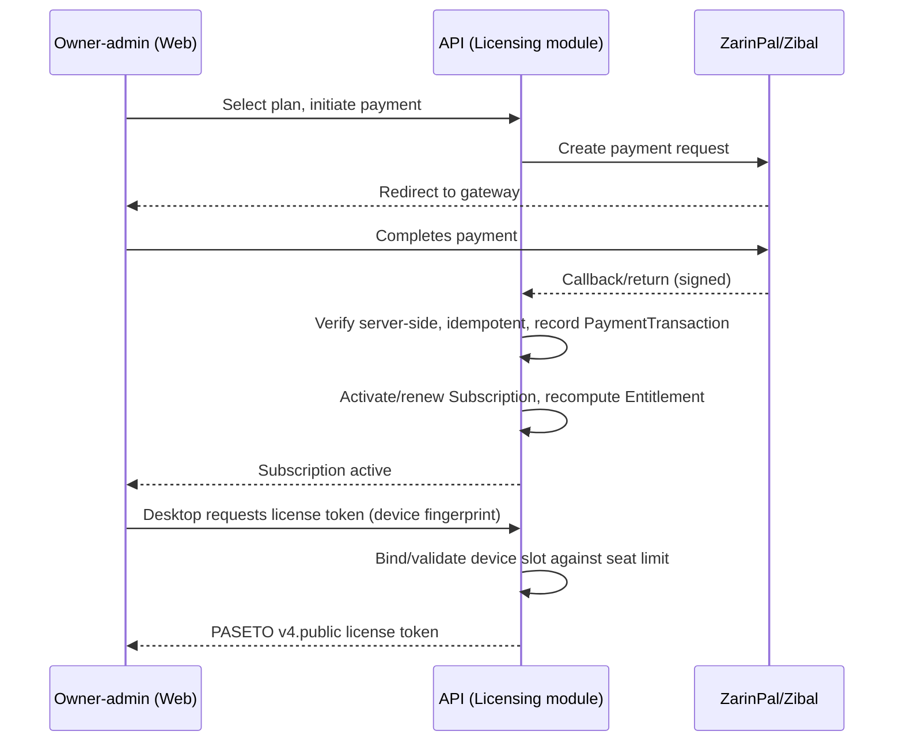
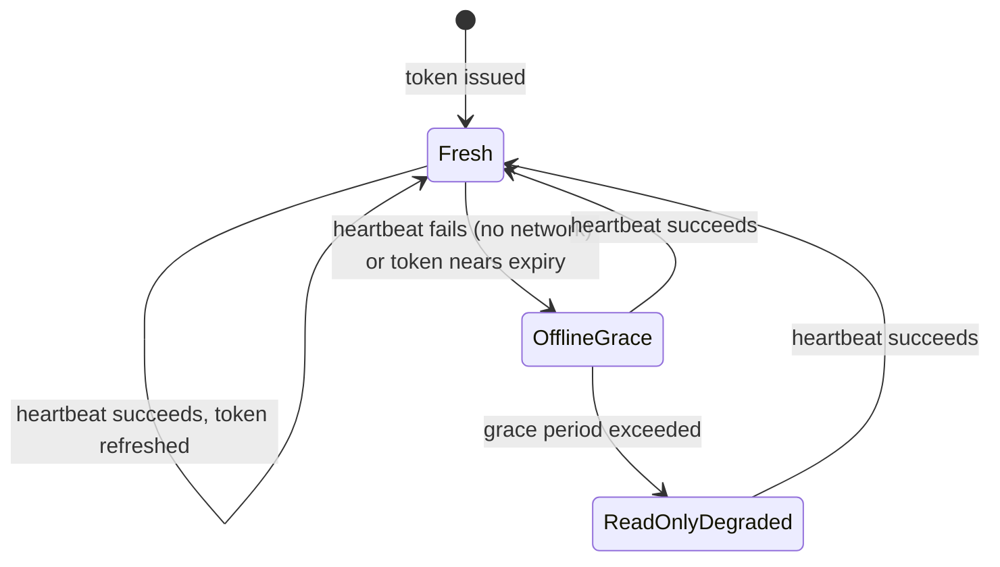

## Contract

Decides: the plan/entitlement model, purchase-to-activation flow, license token schema, device
binding, heartbeat/offline-grace state machine, degradation behavior, seat/limit enforcement
points, and the explicit limits of the anti-tamper posture. Does not decide authentication
mechanics (see [10](10-security-and-access-control.md), a separate concern from entitlement gating).

## Plan / entitlement model

- A `Plan` (platform-level, `ReferenceOnly` sync class) defines: feature flags (per module area),
  seat/device count limit, record/storage limits, data retention window, report tier — LIC-01.
- A tenant's `Subscription` references exactly one `Plan` at a time and has its own state machine
  (see [05-domain-model.md#subscription](05-domain-model.md)) — LIC-02.
- `Entitlement` is the resolved, point-in-time snapshot of what a `Subscription` currently grants;
  it is recomputed by the server whenever the subscription or plan changes, never hand-edited —
  LIC-03.

## Purchase -> activation -> token flow

LIC-04: payment verification is idempotent and never trusts a client-supplied "payment succeeded"
flag — only the server-to-gateway verify call and signed callback are trusted (mirrors SEC threat
table). LIC-05: no true auto-recurring billing exists (gateway limitation, TECH_STACK §9); renewal
is a repeat of this same flow, prompted by the dunning pipeline (see [14](14-jobs-and-notifications.md)).

## License token claim schema

PASETO v4.public, `Ed25519`-signed (private key server-only). Claims: `tenantId`, `planCode`,
`entitlements[]` (feature flags + limits), `deviceFingerprint`, `issuedAt`, `expiresAt`,
`heartbeatIntervalHint`. LIC-06: the token is a cache of server truth for offline UX, never itself
the enforcement authority for server-mediated actions (INV-16).

## Device binding

- LIC-07: device fingerprint (hardware-derived, stable across reboots, not across OS reinstall) is
  registered at first license request and stored against the tenant's seat count.
- LIC-08: exceeding the plan's device/seat limit at registration time is rejected server-side with
  `ERR-LICENSING-SEAT-LIMIT`; the owner-admin manages active devices from the web panel (revoke a
  seat to free it for a new device).
- LIC-09: a revoked device's next heartbeat or sync handshake is rejected (ties to SEC-08 device
  revocation), forcing re-authentication and a fresh (denied, if seat still full) token request.

## Heartbeat and offline-grace state machine

- LIC-10: heartbeat is a lightweight periodic server call (desktop local job, see
  [08](08-desktop-local-data.md) `job` table) that refreshes the cached token and confirms
  subscription/device validity. Its absence never blocks local writes while in `Fresh` or
  `OfflineGrace`.
- LIC-11: the offline grace duration matches the product's offline quality target
  ([01-context-and-drivers.md](01-context-and-drivers.md), ≥ 14 days) — full functionality, zero
  degradation, before moving to `ReadOnlyDegraded`.
- LIC-12: `ReadOnlyDegraded` disables new record creation/mutation locally (data remains fully
  visible/exportable) until connectivity restores and a heartbeat succeeds; it never deletes local
  data (mirrors DESK-06 "server is source of truth" trust direction).

## Degradation behavior

| State | Local read | Local write | Sync | Server-mediated features (payments, SMS trigger, reports) |
|---|---|---|---|---|
| Fresh | Full | Full | Full | Full |
| OfflineGrace | Full | Full | Queued (outbox) | Blocked until online (already true regardless of license state) |
| ReadOnlyDegraded | Full | Blocked (`ERR-LICENSING-GRACE-EXPIRED`) | Blocked | Blocked |

## Seat / limit enforcement points

- LIC-13: seat/device limits enforced at license-token issuance (server, LIC-08) — the single
  chokepoint; no secondary client-side seat counting exists to bypass.
- LIC-14: record/storage limits (e.g., max attachments storage per plan) enforced at the owning
  module's write path server-side (Files module for storage, see [17](17-files-and-attachments.md));
  desktop shows a soft warning proactively but the server call is what actually blocks (INV-16).
- LIC-15: report-tier gating (`reports.view-advanced`) enforced via `Microsoft.FeatureManagement`
  bound to the entitlement snapshot, checked server-side per request; web/desktop UI hides gated
  menu items as UX only.

## Anti-tamper posture and its explicit limits

- Controls in place: Authenticode signing, lightweight obfuscation of licensing code paths,
  hardware fingerprint binding, monotonic clock tamper detection, server re-validation of every
  server-mediated action (TECH_STACK §9) — LIC-16.
- Explicit limit (LIC-17): none of the above prevents a sufficiently motivated attacker from
  patching the desktop binary to bypass local UI gating entirely. This is accepted risk, not a gap
  to "eventually fix" — the real enforcement boundary is the server, which independently
  re-validates entitlements on every request that touches shared/tenant data, payments, sync, or
  notifications. A fully offline, patched desktop can only ever affect its own local, never-synced
  data — it can never fabricate a paid feature's server-side effect (e.g., it cannot forge a valid
  invoice number sequence, post a ledger entry, or send SMS) because those all require a
  successful server round-trip that re-checks LIC-03's authoritative entitlement snapshot.
- LIC-18: clock tamper detection affects license grace state only (LIC-11/LIC-12), never sync data
  ordering (which relies on HLC, not wall clock — see [09-sync-architecture.md](09-sync-architecture.md)).

## Renewal / dunning integration points

- LIC-19: renewal reminders and dunning are Hangfire recurring jobs (see
  [14-jobs-and-notifications.md](14-jobs-and-notifications.md)) reading `Subscription` state; they
  produce standard notification events (`subscription-expiry`), not a bespoke channel.
- LIC-20: a `Subscription` entering `GracePeriod` ([05](05-domain-model.md)) immediately triggers a
  reminder notification and starts the same clock that eventually drives `ReadOnlyDegraded` on
  desktop (LIC-11) and reduced access on web (web has no offline grace concept — see
  [13-web-architecture.md](13-web-architecture.md) — it simply reflects current server entitlement
  state on every load).
