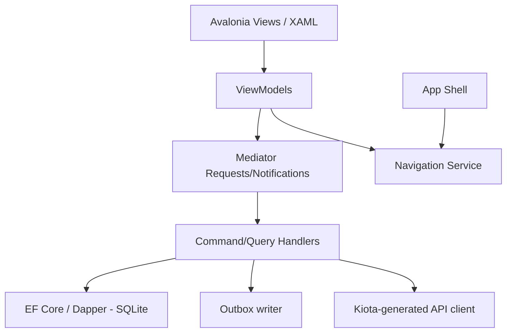
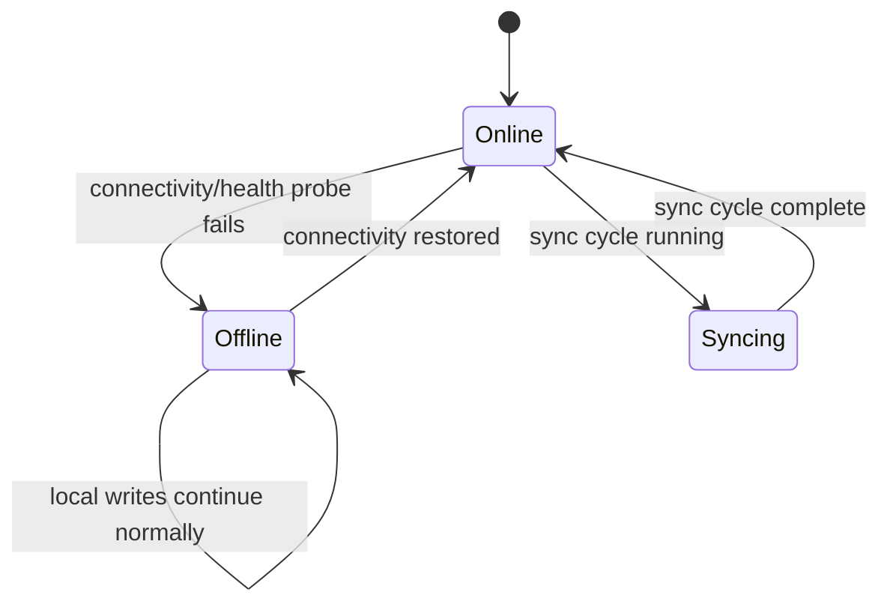
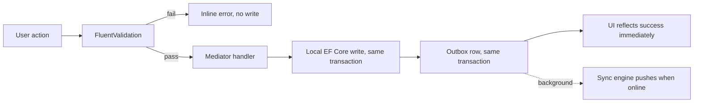
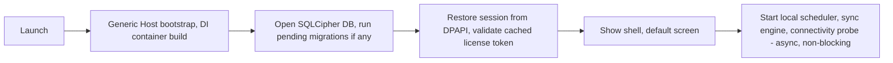

## Contract

Decides: internal layering of the Avalonia app, MVVM boundaries, navigation/shell composition, the
offline/online/syncing UX state model, the command pipeline, long-operation UX, theming/RTL/
localization architecture, printing abstraction, startup sequence/budget, and update flow. Does not
decide local data schema (see [08](08-desktop-local-data.md)) or sync internals (see [09](09-sync-architecture.md)).

## Layering

DESK-ARCH-01: Views bind to ViewModels only; ViewModels never reference `View` types
(`CommunityToolkit.Mvvm`, TECH_STACK §4). DESK-ARCH-02: ViewModels dispatch all state changes
through `Mediator` requests handled by module-specific handlers — a ViewModel never opens a raw
`DbContext` or `HttpClient` itself.

## MVVM boundaries

- One ViewModel per screen/dialog; shared cross-screen state (current user, connectivity/sync
  status, entitlement snapshot) lives in a small set of injected singleton "app state" services,
  not in a shared base ViewModel god-object — DESK-ARCH-03.
- Validation: `FluentValidation` rules (shared with backend via `Animora.SharedKernel.Validation`,
  see [03](03-solution-structure.md)) run in the handler layer, not in the ViewModel, so desktop and
  server enforce identical rules — DESK-ARCH-04.

## Navigation and shell composition

- Single-window shell with a region-based content host; navigation is a service
  (`INavigationService`) resolving views by a route key registered per module at composition root
  — DESK-ARCH-05. Each `Desktop.Modules.X` project registers its own routes; the shell has zero
  compile-time knowledge of module-specific screens (keeps INV-01's spirit on the desktop side).
- RTL layout (`FlowDirection=RightToLeft`) is set once at the shell root; module screens never
  override flow direction individually — DESK-ARCH-06.

## Offline / online / syncing UX state model

DESK-ARCH-07: this state is surfaced as a small persistent status indicator, never a blocking
modal — the UI never blocks input on connectivity state (TECH_STACK §4, INV-15). DESK-ARCH-08: the
indicator also reflects the licensing state from [11-licensing-and-entitlements.md#heartbeat-and-offline-grace-state-machine](11-licensing-and-entitlements.md)
when in `ReadOnlyDegraded`, since that is the one state that does change write availability.

## Command pipeline

DESK-ARCH-09: local write and outbox enqueue happen in one SQLite transaction — a command is never
"half applied" (matches SYNC-R-14's spirit on the client side). DESK-ARCH-10: the UI never waits
on network round-trip to acknowledge a command; perceived latency is local-disk speed only.

## Long-operation and job UX

- Long operations (report export, bulk import, large attachment upload) run as tracked local jobs
  (`job` table, [08](08-desktop-local-data.md)) with a non-blocking progress surface (toast +
  in-app job center), matching the server's job-status pattern ([06-api-contract.md#standard-response-shapes](06-api-contract.md))
  so the same ViewModel pattern serves local and server-driven long operations — DESK-ARCH-11.

## Theming, RTL, localization architecture

- Theme base `Semi.Avalonia` + project design tokens (colors, spacing) defined once in a shared
  resource dictionary; module screens consume tokens, never hardcode values — DESK-ARCH-12.
- Fonts: `Vazirmatn` embedded and set as the default app font; icons via
  `Projektanker.Icons.Avalonia` (Material Design set) — DESK-ARCH-13.
- Persian RTL correctness is a per-screen smoke-tested concern (`Avalonia.Headless`, TECH_STACK
  §20 known risk) — new screens add a headless RTL smoke test as part of their definition of done
  ([20-extensibility-playbook.md](20-extensibility-playbook.md)).
- Jalali dates: `.NET PersianCalendar` + custom formatters at the ViewModel-to-View binding edge
  only; domain/handler code always works in UTC (INV-13) — DESK-ARCH-14.

## Printing abstraction

- One `IPrintService` abstraction with two backends: Windows spooler (A4/A5 reports via
  `QuestPDF`-rendered documents) and ESC/POS thermal (receipts/labels) — DESK-ARCH-15. Screens
  request a print job by document type; the abstraction picks the backend by document type and
  configured default printer, never by screen-specific logic.

## Startup sequence and cold-start budget

DESK-ARCH-16: `ShellShow` is not gated on `BackgroundInit` completing — target ≤ 3 s to interactive
shell ([01-context-and-drivers.md](01-context-and-drivers.md)). DESK-ARCH-17: trimming is disabled
(Avalonia reflection needs, TECH_STACK §4); startup budget is achieved via ReadyToRun + Workstation
GC + deferred background init, not trimming.

## Update flow

- `Velopack` delta updates from a self-hosted feed served by Caddy (TECH_STACK §4, §15) —
  DESK-ARCH-18. Update check is a local recurring job; download is resumable and staged; applying
  an update requires app restart, prompted non-intrusively (never forced mid-session except when a
  sync protocol refusal demands it, SYNC-R-09) — DESK-ARCH-19.
- Staged rollout is a server-side feed concern (percentage of devices see the new version first),
  not a desktop-code concern.
