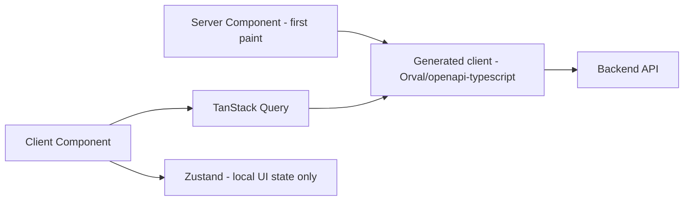

## Contract

Decides: App Router segmentation, server/client component boundary, data-fetching/caching layers,
auth/session transport, the generated-client layer, offline read-cache/queued-mutation scope (and
its deliberate limits versus desktop), realtime, RTL/i18n architecture, and bundle/perf budgets.
Does not decide desktop offline scope (see [12](12-desktop-architecture.md)) or the API contract
itself (see [06](06-api-contract.md)).

## App Router segmentation

| Segment | Rendering | Content |
|---|---|---|
| `(marketing)` | SSG/ISR | Pricing, blog, landing — served static so the weak VPS handles public traffic cheaply (TECH_STACK §5, §20) |
| `(app)` | Server components for data-heavy shells, client components for interactive forms/tables | Authenticated clinic app: owners, patients, visits, scheduling, finance, reports |
| `(admin)` | Server components, authenticated, platform-admin only | Back-office: tenants, subscriptions, backups |

WEB-01: only `(marketing)` uses ISR; `(app)` and `(admin)` are always dynamically rendered or
client-fetched — subscription/entitlement/tenant data is never safe to cache at the edge across
tenants.

## Server/client component boundary

- WEB-02: Server components handle initial data fetch for a route (via the generated API client,
  server-side, using the session cookie) and layout/shell rendering; they never hold interactive
  state.
- WEB-03: Client components own all interactivity: forms (`react-hook-form` + `zod`), tables
  (`TanStack Table`/`Virtual`), charts (`echarts-for-react`, lazy-loaded), and any `TanStack Query`
  cache-backed re-fetching after a mutation.
- WEB-04: A route's server component fetches the first paint's data; subsequent client-side
  refetching/pagination uses `TanStack Query` against the same generated client, keeping exactly
  one code path for "how do I call the API" (no parallel fetch logic).

## Data-fetching and caching layers

WEB-05: `Zustand` holds UI-only state (open dialogs, wizard step, selected filters) — never server
data, which always lives in `TanStack Query`'s cache to avoid dual sources of truth. WEB-06:
Next.js `fetch` caching is disabled by default for `(app)`/`(admin)` routes (`cache: "no-store"`
via the generated client's server-side fetch wrapper); explicit revalidation is opt-in per route
only where staleness is acceptable (e.g., plan catalog listing).

## Auth/session transport

- WEB-07: session transport is the httpOnly refresh-token cookie described in
  [10-security-and-access-control.md#authn-flows](10-security-and-access-control.md); the web app
  never stores tokens in `localStorage` (TECH_STACK §18). Server components read the cookie
  directly; client components never see the raw token, only authenticated-fetch results via the
  generated client's same-origin call path.

## Generated-client layer

- WEB-08: `lib/api-client` = `openapi-typescript` types + Orval-generated `TanStack Query` hooks
  (TECH_STACK §5). No hand-written DTOs or fetch wrappers duplicate this layer (INV-02, DIR-06).
- WEB-09: `zod` form schemas are derived from the same OpenAPI spec fields they validate, kept
  alongside the generated client, not hand-duplicated per form.

## Offline read-cache and queued-mutation scope (deliberate limits vs desktop)

| Capability | Desktop | Web |
|---|---|---|
| Full offline write | Yes, indefinite (grace-limited by license, not by architecture) | No |
| Read cache while offline | Full local database | Limited: last-fetched data via `Dexie`/IndexedDB for a small, explicitly whitelisted set of read views (today's appointments, patient quick-lookup) — WEB-10 |
| Queued mutations while offline | Full outbox for all synced entities | None — web has zero queued-mutation support; a network failure surfaces an inline error and the user retries manually — WEB-11 |
| Rationale | Product promise: clinics run desktop with no internet for days | Web is explicitly online-first (TECH_STACK §1); building a second full offline-write engine would duplicate [09-sync-architecture.md](09-sync-architecture.md) business logic in a second language/runtime, violating INV-02's single-business-logic intent |

WEB-12: `Serwist` service worker exists only to cache static assets and the small whitelisted read
set for PWA installability and brief-flake resilience, never to queue writes (TECH_STACK §5). This
boundary is a permanent architectural decision, not a temporary gap — see ADR-0011.

## Realtime

- WEB-13: `@microsoft/signalr` client connects to the backend SignalR hub for push-accelerated
  updates (new notification, sync-relevant change on a currently open record) per TECH_STACK §6;
  correctness never depends on this connection (it is an accelerant over `TanStack Query`
  refetch-on-focus/interval, matching the sync module's "push as accelerator only" rule).

## RTL / i18n architecture

- WEB-14: `next-intl` with `fa` as default locale, `en` scaffold only (not a marketed feature);
  `dir="rtl"` set at the root layout; Tailwind logical properties (`ps/pe/ms/me`) used exclusively
  — no physical `left/right` utility classes anywhere in the codebase (TECH_STACK §5, lint-enforced
  via Biome custom rule).
- WEB-15: `date-fns-jalali` is the only date-formatting path for user-facing dates; ISO/UTC is used
  for all data exchange with the API (INV-13).

## Bundle / perf budgets

| Budget | Target |
|---|---|
| Marketing route JS (first load) | ≤ 100 KB gzipped (SSG, minimal client JS) |
| Authenticated app shell JS (first load) | ≤ 250 KB gzipped, charts/heavy tables lazy-loaded |
| Largest Contentful Paint, marketing | ≤ 2.0 s on 3G-equivalent throttling |
| Time to Interactive, authenticated app | ≤ 2.5 s on mid-tier hardware |
| Chart library | Loaded only on routes that render a chart (`echarts-for-react` code-split) |

These budgets are enforced by CI bundle-size checks (Biome/Next build analyzer output) referenced
from the web project's own CI config, not restated as tooling instructions here (INV-18).
