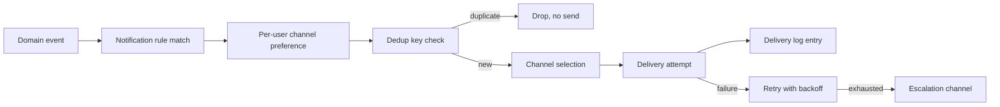

## Contract

Decides: job taxonomy (server vs desktop), idempotency/concurrency caps, the notification pipeline
stages, channel abstraction/failover, quiet hours/throttling, the local-vs-remote firing split for
offline clinics, and the alert-source catalog. Does not decide entity/state-machine detail that
triggers alerts (see [05](05-domain-model.md)) or finance specifics (see [15](15-finance-and-ledger.md)).

## Job taxonomy

| Location | Mechanism | Examples |
|---|---|---|
| Server recurring | Hangfire recurring job (PostgreSQL storage) | Renewal/dunning sweep, materialized view refresh, tombstone purge, partition creation, backup verification, aging reports |
| Server one-off/delayed | Hangfire fire-and-forget/delayed job | Send a single SMS/email, process a payment webhook follow-up, generate an export file |
| Desktop local recurring | `BackgroundService` + `PeriodicTimer` over `job` table ([08](08-desktop-local-data.md)) | Sync cycle, local reminder evaluation, local backup snapshot, update check, license heartbeat |

JOB-01: every job type declares idempotency behavior explicitly at implementation time (INV-11);
"idempotent by omission" is not acceptable — a job either checks a completion marker or is
naturally safe to repeat (e.g., a recompute).

## Idempotency and concurrency caps

- JOB-02: server Hangfire workers are capped (configured, low default) to respect the 4 GB/2 vCPU
  ceiling (TECH_STACK §11); a burst of due reminders queues rather than spikes CPU.
- JOB-03: desktop jobs run on a single background scheduler thread pool sized for old hardware;
  jobs are short and cooperative (yield via `PeriodicTimer` ticks), never long CPU-bound loops on
  the UI thread.
- JOB-04: every job records a correlation id in its log line, threaded through to any notification
  or sync batch it triggers, for cross-system tracing (ties to [18](18-observability-and-operations.md)).

## Notification engine pipeline

- NOTIF-01: a domain event (e.g., `AppointmentReminderDue`) is raised by its owning module
  ([04-module-catalog.md](04-module-catalog.md)) and enqueued to Notifications via `Mediator`; the
  Notifications module never polls source modules' tables directly (respects INV-01).
- NOTIF-02: dedup key = `(eventType, sourceEntityId, occurrenceWindow)` — prevents duplicate alerts
  for the same event even if the source fires it twice (e.g., a job re-run).
- NOTIF-03: escalation is a configured fallback channel (e.g., SMS after email delivery failure for
  a high-priority alert type) attempted only after normal retry-with-backoff is exhausted.
- NOTIF-04: full delivery log is retained server-side (partitioned per DATA-06) for support and
  compliance visibility; desktop keeps a bounded local mirror (pruned per DESK-13).

## Channel abstraction and provider failover

| Channel | Primary provider | Failover | Notes |
|---|---|---|---|
| SMS | SMS.ir | Kavenegar | Delivery-status callback stored per attempt (TECH_STACK §10) |
| Email | SMTP via MailKit | — (retried, not failed-over to a second provider) | Templated via `Scriban` |
| Web push | VAPID | — | Web only |
| In-app | SignalR + persisted feed | — | Works whenever the client is connected |
| Desktop native | Windows toast via `DesktopNotifications.Avalonia` | In-app toast fallback | No server dependency to display |

NOTIF-05: channel selection is abstracted behind one `INotificationChannel` interface per channel;
adding a channel never touches rule-evaluation or dedup logic (see
[20-extensibility-playbook.md](20-extensibility-playbook.md) recipe).

## Quiet hours and throttling

- NOTIF-06: per-tenant quiet hours suppress non-urgent channels (SMS/push) during a configured
  window; urgent categories (e.g., sync failure, backup failure) bypass quiet hours.
- NOTIF-07: per-tenant throttle caps total outbound SMS/email per hour to control cost and avoid
  provider rate-limit rejection; excess is queued, not dropped.

## Local-vs-remote firing split for offline clinics

- NOTIF-08: reminder *computation* for time-based alerts (vaccination due, appointment reminder,
  cheque due) happens both server-side (for remote channels: SMS/email/push) and desktop-side (for
  local channels: toast/in-app), each independently evaluating the same rule against its own copy
  of the data (TECH_STACK §10) — an offline clinic still gets local alerts even though SMS cannot
  be sent without connectivity.
- NOTIF-09: the desktop's `reminder` table ([08](08-desktop-local-data.md)) is populated by a local
  recurring job that re-evaluates due dates against locally synced data; it does not wait for a
  server push, since the whole point is offline resilience.
- NOTIF-10: once connectivity returns, the server's own copy of the same reminder logic still
  drives remote channels — there is no "catch-up SMS burst" for alerts that were already
  meaningless once back online (e.g., a missed daily digest is not resent); this is a per-alert-type
  configuration, not a blanket rule.

## Alert-source catalog

| Alert source | Trigger | Default channels | Owning module |
|---|---|---|---|
| Record created | New patient/owner record saved | In-app | Clients |
| Vaccination/deworming due | Reminder rule against biometric/medical schedule | Local toast, SMS, in-app | Visits/Scheduling |
| Appointment reminder | Time-to-appointment threshold | Local toast, SMS, web push | Scheduling |
| Appointment no-show follow-up | `Appointment` -> `NoShow` transition | In-app, email | Scheduling |
| Treatment follow-up | Visit outcome flags follow-up needed | In-app, SMS | Visits |
| Lab result ready | `LabResult` created | In-app, SMS | Visits |
| Cheque due/returned | Cheque state machine transition | In-app, SMS | Finance |
| Unpaid invoice/debt aging | Aging report threshold (recurring job) | In-app, SMS, email | Finance |
| Inventory low stock / drug expiry | Threshold check on stock levels (if tracked) | In-app, email | Visits/Finance (product catalog) |
| Subscription expiry | `Subscription` -> `GracePeriod` | In-app, email, SMS | Licensing |
| Sync failure | Repeated sync handshake/push failure | In-app, escalate to email | Sync |
| Backup failure | Backup verification job failure | Email to platform admin + tenant owner-admin | PlatformAdmin |
| Staff task due | Assigned task/appointment reaching due time | In-app, local toast | Scheduling |

This table is the single source for alert sources (INV-18); adding a new one follows the recipe in
[20-extensibility-playbook.md](20-extensibility-playbook.md) and appends a row here.
