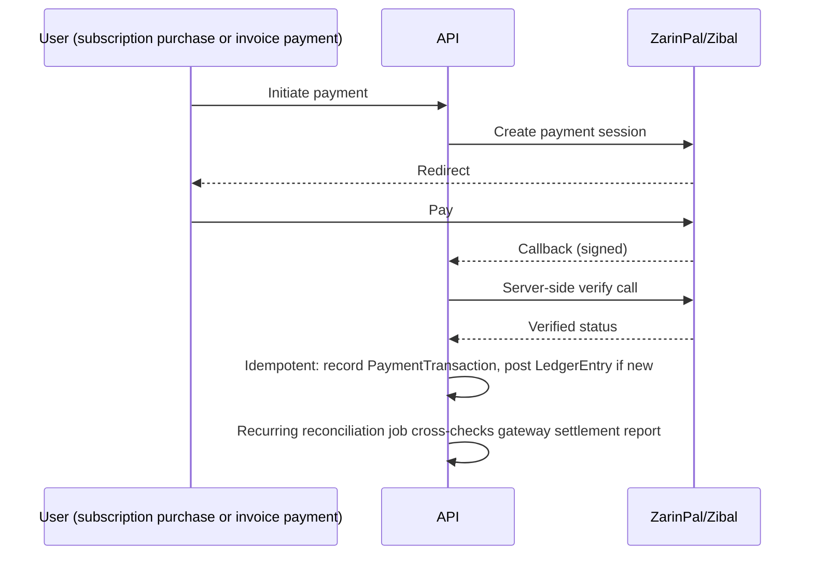

## Contract

Decides: the append-only ledger design, account/journal concepts, invoice lifecycle/template/
preview model, cash session model, cheque lifecycle, expense/income classification, payment
gateway reconciliation flow, rounding/precision rules, and how reports derive from the ledger.
Explicitly states what is forbidden. Does not decide reporting materialization mechanics (see
[16](16-reporting-and-analytics.md)) or table/index physical design (see [07](07-server-data-architecture.md)).

## Money architecture: ledger design

- FIN-01: `LedgerEntry` is the single source of financial truth. Every money-affecting event
  (invoice issued, payment received, expense recorded, cheque cleared, cash movement) posts one or
  more `LedgerEntry` rows. No other table is trusted for "what happened financially."
- FIN-02: `LedgerEntry` is append-only (INV-06); corrections are new offsetting entries linked to
  the original by `reversalOfEntryId`, never an update or delete.
- FIN-03: each `LedgerEntry` carries: `accountCode`, `direction` (debit/credit), `amount`
  (`decimal(18,2)`), `currency` (fixed `IRR`, no multi-currency per TECH_STACK §19 out-of-scope),
  `sourceType`/`sourceId` (the domain event that caused it), `postedAtUtc`, `tenantId`.
- FIN-04: `accountCode` is drawn from a small, fixed chart of accounts covering the product's
  revenue areas (visit services, grooming, product sales, cheque clearing, cash till, accounts
  receivable) — not a general-purpose accounting system; this is deliberately scoped to what the
  product needs (see ADR-0007).

## Account / journal concepts

- FIN-05: a "posting" is a set of `LedgerEntry` rows sharing one `journalId` (a grouping key, not a
  separate table) that must balance (sum of debits = sum of credits) within the same database
  transaction — enforced at the application layer in the Finance module's posting service, the
  single writer of `LedgerEntry` (no other module inserts `LedgerEntry` directly, per INV-01).
- FIN-06: reports read balances by aggregating `LedgerEntry` (via materialized views, see
  [16](16-reporting-and-analytics.md)), never by maintaining a separately-mutable running-balance
  column that could drift from the ledger.

## Invoice lifecycle, template, and preview model

- Lifecycle state machine: see [05-domain-model.md#invoice](05-domain-model.md).
- FIN-07: `InvoiceTemplate` defines layout/branding per revenue area (e.g., a grooming receipt
  template vs a full clinical invoice template); templates are data (stored layout config +
  `Scriban`-style placeholders for print rendering via `QuestPDF`), not code — adding a template is
  a data operation, not a deployment (see [20-extensibility-playbook.md](20-extensibility-playbook.md)).
- FIN-08: "live preview before issue" renders the same template engine against the in-memory
  `Draft` invoice state without persisting anything or touching the ledger (DOM-06) — preview is a
  pure read/render operation, never a side-effecting one.
- FIN-09: issuing an invoice (`Draft` -> `Issued`) is the single moment a ledger posting occurs for
  that invoice (an accounts-receivable debit + revenue credit); subsequent payments post separate
  entries referencing the invoice.
- FIN-10: voiding an issued invoice never deletes or edits it (DOM-06); it requires a `CreditNote`
  record that itself posts an offsetting `LedgerEntry` (FIN-02).

## Cash session model

- Lifecycle: see [05-domain-model.md#cash-session](05-domain-model.md); DOM-05 enforces one open
  session per till per tenant.
- FIN-11: `CashMovement` rows (cash in/out during an open session) each post a corresponding
  `LedgerEntry` at the moment of movement, not deferred to session close.
- FIN-12: session close performs reconciliation: expected balance (sum of movements) compared
  against counted physical balance entered by staff; any variance posts an explicit
  `ERR-FINANCE-CASH-VARIANCE`-flagged adjusting `LedgerEntry` (never silently absorbed) — FIN-13.

## Cheque lifecycle

- Lifecycle: see [05-domain-model.md#cheque](05-domain-model.md).
- FIN-14: a cheque registered as received posts a ledger entry moving the amount into a "cheques in
  clearing" account; clearing moves it to cash/bank; returning it reverses the clearing-account
  entry and requires `returnReasonCode` (DOM-07).
- FIN-15: cheque due-date tracking feeds the `cheque due/returned` alert source
  ([14](14-jobs-and-notifications.md)); the alert is a read-side concern and never itself mutates
  cheque state.

## Expense / income classification

- FIN-16: `Expense` and `Income` records are categorized (fixed, tenant-extendable category list)
  and each posts a `LedgerEntry` on creation; they are otherwise simple, non-state-machine entities
  (`MutableLWW` sync class for the record metadata, but their ledger posting is `AppendOnly` and
  immutable once posted — editing an expense's amount after posting requires a reversal + new
  entry, matching FIN-02, not an in-place edit of the original ledger rows).

## Payment gateway integration flow and reconciliation

- FIN-17: every payment produces a `PaymentTransaction` audit row regardless of outcome
  (success/failure/ambiguous); ambiguous outcomes (callback missing, verify timeout) are resolved
  by the recurring reconciliation job against the gateway's settlement report, never left unposted
  indefinitely.
- FIN-18: verification and posting are idempotent keyed by gateway transaction reference — a
  duplicate callback never double-posts (ties to SEC threat table and SYNC-R-20's "server re-derives"
  pattern for the same reason).

## Rounding / precision rules

- FIN-19: all monetary computation uses `decimal(18,2)` (IRR/Toman has no fractional sub-unit in
  practice for this product; `float`/`double` for money is forbidden, INV-05).
- FIN-20: rounding mode is banker's rounding (`MidpointRounding.ToEven`) applied consistently at
  the single point where a computed amount is persisted (e.g., a percentage discount calculation);
  intermediate calculations retain full decimal precision until that persistence point.

## How reports derive from the ledger

- FIN-21: every financial report/chart ([16](16-reporting-and-analytics.md)) is a read model
  derived from `LedgerEntry` (directly or via materialized view) — never from a separately
  maintained summary table that could drift. This is what makes the ledger the actual source of
  truth rather than a compliance afterthought.

## What is forbidden

- No `UPDATE` or `DELETE` on `LedgerEntry` after commit (INV-06, DB-trigger enforced, DATA-08).
- No module other than Finance's posting service inserts `LedgerEntry` rows (INV-01).
- No invoice in `Issued` state or later is ever edited in place (DOM-06); no cheque is ever deleted
  once registered — cancellation is a state transition, not a row removal.
- No "reset cash session" operation exists; a miscounted session is corrected via a documented
  variance entry (FIN-13), never by reopening/deleting the session.
- No multi-currency support (TECH_STACK §19); `currency` is always `IRR`.
