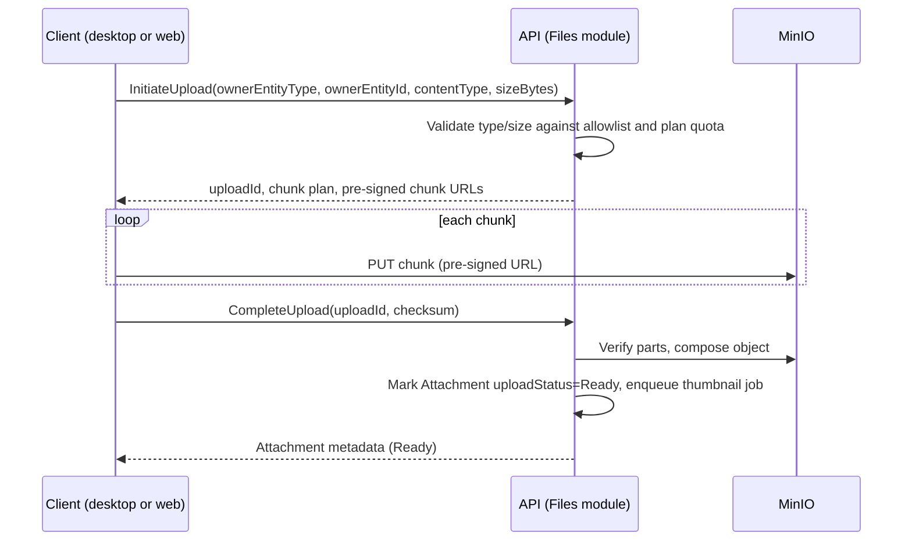

## Contract

Decides: attachment domain model, S3 key/bucket layout and tenant scoping, chunked/resumable
upload flow, access control and URL issuance, thumbnailing/desktop cache, quota/retention, sync
interaction, and malware/type policy. Does not decide sync protocol mechanics generally (see
[09](09-sync-architecture.md), which this file only extends for the attachment-specific case).

## Attachment domain model

- FILE-01: `Attachment` is a `MutableLWW`-classed synced entity holding metadata only: `id`,
  `tenantId`, `ownerEntityType` (`Visit`, `LabResult`, `MedicalFile`, etc.), `ownerEntityId`,
  `s3Key`, `contentType`, `sizeBytes`, `checksum`, `uploadStatus`, `thumbnailS3Key` (nullable).
- FILE-02: binary content never lives in PostgreSQL or SQLite; the metadata row is the only
  database-resident artifact (TECH_STACK §7 "never write attachments to app-local paths" extended
  to mean never to the database either).

## S3 key / bucket layout and tenant scoping

- FILE-03: one bucket per environment (not per tenant, to keep MinIO administration simple on a
  single VPS); key prefix encodes tenant: `{tenantId}/{ownerEntityType}/{ownerEntityId}/{attachmentId}/{original|thumb}.{ext}`.
- FILE-04: tenant isolation for attachments is enforced at the application layer (Files module
  issues keys and pre-signed URLs only for the requester's own tenant prefix) since S3-compatible
  storage has no native per-tenant RLS equivalent — this is documented as a narrower isolation
  layer than the database's RLS and is compensated by short-lived signed URLs (FILE-07) rather than
  bucket-level ACL per tenant, which MinIO on a single node does not make operationally cheap.

## Chunked / resumable upload flow

- FILE-05: uploads are resumable — a client that loses connection mid-upload resumes from the last
  acknowledged chunk using the same `uploadId` (TECH_STACK §7).
- FILE-06: server-side content-type and size validation happens at `InitiateUpload` (reject early)
  and again at `CompleteUpload` (verify actual bytes match declared type via signature sniffing,
  not just the client-supplied header) — defense against a spoofed content-type.

## Access control and URL issuance

- FILE-07: downloads are served via short-lived pre-signed URLs issued per request after a
  permission check against the owning entity (e.g., `visits.write`/`medical-file.read` depending on
  `ownerEntityType`) — never a permanently public object URL.
- FILE-08: thumbnail URLs follow the same issuance path as originals; there is no separate,
  unauthenticated thumbnail endpoint.

## Thumbnailing and desktop cache

- FILE-09: thumbnails are generated server-side (`SkiaSharp`-equivalent processing triggered as a
  Hangfire job after upload completes) for images; non-image attachments (PDFs of lab reports) get
  a fixed placeholder icon, not a rendered thumbnail, to keep server CPU load predictable.
- FILE-10: desktop caches downloaded originals and thumbnails in a local file-system cache
  (encrypted-at-rest via the OS-level disk encryption expectation, not SQLCipher, since these are
  not domain database files) keyed by `attachmentId` + checksum, with an LRU eviction policy bounded
  by a configurable cache size — this is the one place binary content touches local disk outside
  SQLite, and it is a pure cache (always re-derivable from S3), never a write-of-record.

## Quota / retention

- FILE-11: storage quota is a plan entitlement (LIC-14, [11](11-licensing-and-entitlements.md)),
  enforced at `InitiateUpload` server-side; exceeding quota returns `ERR-FILES-QUOTA-EXCEEDED`.
- FILE-12: attachments are retained indefinitely by default (clinical/financial records) unless a
  tenant explicitly deletes the owning entity, which tombstones the `Attachment` metadata (INV-04)
  and enqueues a delayed physical S3 deletion job (delayed to allow tombstone sync propagation and
  undo-window safety before binary loss).

## Sync interaction

- FILE-13: attachment metadata syncs first via the normal batch protocol (SYNC-R-25); binary
  content sync is a separate, lower-priority, resumable background stream (SYNC-R-26) — a device
  can see "there is an attachment" long before the bytes arrive, shown as a pending-download state
  in the UI rather than blocking the owning record's usability.

## Malware / type policy

- FILE-14: extension allowlist only (images: jpg/png/webp; documents: pdf; no executable, script,
  or archive types ever accepted) — TECH_STACK §7 "virus-free policy by extension allowlist"; there
  is no on-server antivirus scanning engine in the stack, so the allowlist is the entire control —
  this limit is recorded, not silently assumed away (see [23-architecture-risks.md](23-architecture-risks.md)).
