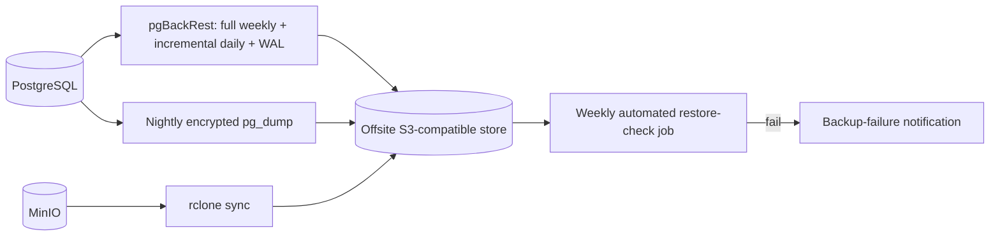

## Contract

Decides: logging/tracing/metrics model, correlation/tenant enrichment, PII scrubbing rules, error-
tracking flow, health-check semantics, runbook-relevant signals, backup/restore architecture and
its verification loop, and the admin back-office operations surface. Does not decide deployment
topology/containers (see [19](19-deployment-topology.md)).

## Logging / tracing / metrics model

- OBS-01: `Serilog` structured JSON logs, rolling and size-capped, on both server and desktop
  (TECH_STACK §13, §4).
- OBS-02: `OpenTelemetry` traces/metrics with OTLP export, sampled to keep overhead low on the
  4 GB VPS (TECH_STACK §13); tracing is enabled on the server only — desktop relies on Serilog logs
  plus the sync/job correlation ids for cross-referencing, not a full local tracing pipeline (would
  be disproportionate overhead for a single-user process).
- OBS-03: every log line and trace span carries `traceId`, `tenantId` (when resolved), and, for
  job-triggered work, the job's correlation id (JOB-04) — this is the join key across logs, traces,
  and the audit chain.

## PII scrubbing rules

- OBS-04: log enrichment scrubs known PII fields (owner name/phone, patient name, payment card
  hints) before a log line is emitted; a fixed scrub list lives beside the Serilog configuration,
  not duplicated here (INV-18). Business identifiers (`tenantId`, entity ids) are not PII and are
  never scrubbed — they are required for support triage.
- OBS-05: error-tracking payloads (GlitchTip) go through the same scrub pipeline before leaving the
  process; stack traces are kept, user-entered free-text fields are not.

## Error-tracking flow

- OBS-06: Sentry-protocol SDKs (server and desktop) point at the self-hosted GlitchTip endpoint
  (TECH_STACK §13); the endpoint URL is configuration ([19](19-deployment-topology.md) env-var
  table), never hardcoded.
- OBS-07: error tracking is best-effort; the application never blocks or degrades user-facing
  behavior because GlitchTip is unreachable (matches SEC/observability posture of "nothing critical
  depends on a non-core external system").

## Health-check semantics

| Endpoint | Meaning | Checks |
|---|---|---|
| `/health/live` | Process is up and can serve traffic at all | No external dependency check |
| `/health/ready` | Process can correctly serve real requests | DB connectivity, S3 connectivity, Hangfire storage reachable |

- OBS-08: `Uptime Kuma` polls `/health/ready` and alerts (SMS/email) on failure (TECH_STACK §13);
  this is the primary uptime signal for a single-VPS deployment with no dedicated ops team.
- OBS-09: a `/health/ready` failure is itself a notification alert source
  ("sync failure/backup failure" family, [14](14-jobs-and-notifications.md)) when it persists past
  a short grace window, so platform admins are proactively alerted rather than relying solely on
  external polling.

## Runbook-relevant signals

- OBS-10: the signals an operator needs during an incident are: `/health/ready` detail payload
  (which dependency failed), the last N Hangfire job failures (dashboard, admin-auth-gated per
  TECH_STACK §6), the last N sync `conflict_log`/dead-letter entries, and GlitchTip's grouped error
  view — these four sources are the complete triage starting point; this doc does not restate
  runbook procedures (operational, not architectural) beyond naming where the signals live.

## Backup and restore architecture

- OBS-11: server backup is infrastructure-level (`pgBackRest`, nightly `pg_dump` for portability,
  `rclone` offsite sync, TECH_STACK §14) — not an application module; PlatformAdmin surfaces status
  only (OBS-13).
- OBS-12: the weekly restore-check job (TECH_STACK §14) performs an actual restore into a scratch
  environment and an integrity check (row-count/checksum spot-check against source), not merely a
  "backup file exists" check — this is what makes the backup loop verified rather than assumed.
- OBS-13: desktop backup is local (encrypted `VACUUM INTO` snapshot, [08](08-desktop-local-data.md));
  the server copy is the source of truth after sync (DESK-06), so desktop backup exists for
  fast local recovery (e.g., accidental local corruption before the next sync), not as the tenant's
  disaster-recovery plan of record.

## Admin back-office operations surface

- OBS-14: `PlatformAdmin` (see [04-module-catalog.md](04-module-catalog.md)) exposes: tenant list
  and status, subscription oversight (view/adjust plan, view payment history), backup status per
  tenant-relevant infrastructure (not per-tenant backups — backups are infrastructure-wide, not
  segmented per tenant), and manual trigger for the backup-verification job.
- OBS-15: platform-admin actions are themselves audit-logged through the same hash-chained
  `audit_log` mechanism as tenant actions (SEC-15), tagged with a platform-admin actor type so they
  are distinguishable in review.
