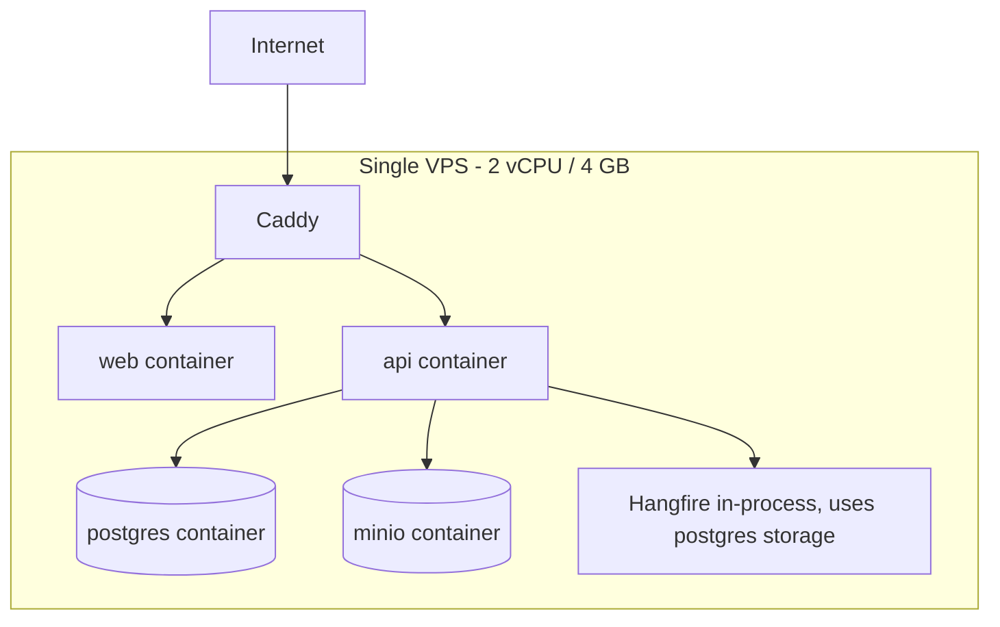
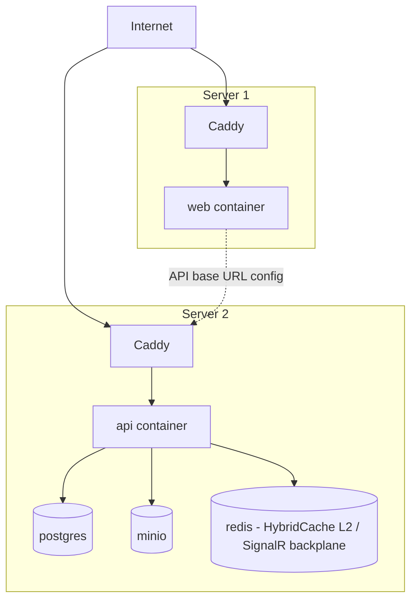

## Contract

Decides: Topology A and B diagrams, container inventory with memory/CPU budgets, network/TLS
boundaries, the full environment-variable configuration surface, secrets handling, the proof that
A->B is config-only, release/rollback mechanics, and the desktop distribution channel. Does not
decide application-layer module design (see [03](03-solution-structure.md), [04](04-module-catalog.md)).

## Topology A (now: single VPS)

## Topology B (later: split)

## Container inventory with memory/CPU budgets (Topology A)

| Container | Memory budget | CPU share | Notes |
|---|---|---|---|
| `caddy` | ≤ 100 MB | shared | TLS termination, static asset serving, reverse proxy |
| `web` (Next.js standalone) | ≤ 300 MB | shared | SSG pages served near-statically |
| `api` (.NET Minimal API + Hangfire in-process) | ≤ 700 MB | shared | Includes Hangfire worker threads, capped concurrency (JOB-02) |
| `postgres` | ≤ 1.5 GB | shared | Tuned per [07-server-data-architecture.md#postgresql-tuning-posture-for-4-gb](07-server-data-architecture.md) |
| `minio` | ≤ 400 MB | shared | Single-node, local disk |
| `glitchtip` `[opt]` | ~200 MB | shared | Only if enabled |
| `uptime-kuma` `[opt]` | ≤ 100 MB | shared | Lightweight |

Sum of core containers (caddy+web+api+postgres+minio) ≤ ~3.0 GB, leaving headroom on the 4 GB host
for OS + optional containers — matches [01-context-and-drivers.md](01-context-and-drivers.md)'s
per-container memory ceiling quality attribute.

## Network and TLS boundaries

- DEPLOY-01: Caddy is the only container exposed to the public internet; all other containers are
  on an internal Docker Compose network reachable only from Caddy/api.
- DEPLOY-02: TLS 1.3 terminates at Caddy (automatic Let's Encrypt); internal container-to-container
  traffic is plaintext on the isolated Compose network (acceptable trust boundary for a
  single-host deployment; Topology B re-establishes TLS or a private network link between hosts —
  see DEPLOY-11).
- DEPLOY-03: desktop-to-server traffic uses certificate pinning with two live pins at all times
  (TECH_STACK §12, TECH_STACK §20 known risk mitigation).

## Configuration surface: environment-variable contract

Every setting an agent needs to change to move from Topology A to B is listed here; nothing else
is required (this table is the proof artifact for the config-only migration requirement).

| Env var | Topology A value shape | Topology B value shape | Consumed by |
|---|---|---|---|
| `API_BASE_URL` | `https://<single-host>/api` | `https://<server2-host>/api` | web |
| `DB_CONNECTION_STRING` | `Host=postgres;...` (Compose service name) | `Host=<server2-postgres-host>;...` | api |
| `S3_ENDPOINT` | `http://minio:9000` (Compose service name) | `https://<server2-minio-host>` or external S3 endpoint | api, web (for direct-upload flows) |
| `S3_BUCKET` | fixed bucket name | unchanged or new bucket name | api |
| `HYBRIDCACHE_L2_PROVIDER` | `none` (L1 in-memory only) | `redis` | api |
| `HYBRIDCACHE_REDIS_CONNECTION` | unset | `<redis-host>:6379` | api |
| `SIGNALR_BACKPLANE_PROVIDER` | `none` (single instance) | `redis` | api |
| `SIGNALR_REDIS_CONNECTION` | unset | `<redis-host>:6379` | api |
| `HANGFIRE_WORKER_COUNT` | small (shared-host default) | larger (dedicated api host) | api |
| `GLITCHTIP_DSN` | self-hosted endpoint URL | unchanged or relocated endpoint URL | api, desktop, web |
| `SMS_PROVIDER_PRIMARY_KEY` / `SMS_PROVIDER_FAILOVER_KEY` | provider credentials | unchanged | api |
| `SMTP_HOST` / `SMTP_CREDENTIALS` | unchanged | unchanged | api |
| `PAYMENT_ZARINPAL_KEY` / `PAYMENT_ZIBAL_KEY` | unchanged | unchanged | api |
| `LICENSE_SIGNING_PRIVATE_KEY` | server-only secret | unchanged, never leaves api host | api |
| `TLS_CERT_DOMAIN` | single domain | one domain per host | caddy |
| `VELOPACK_FEED_BASE_URL` | `https://<single-host>/updates` | `https://<server1-host>/updates` (served with web/Caddy 1) | desktop, caddy |

DEPLOY-04: no code path branches on "which topology am I in" — every difference above is a
connection string, endpoint URL, or provider-selection flag read at startup (INV-12). `HybridCache`
already abstracts L1/L2 (TECH_STACK §6); SignalR already abstracts backplane presence; S3 client
already abstracts endpoint. This is why the split requires zero code change.

## Secrets handling

- DEPLOY-05: secrets (DB password, S3 keys, SMS/SMTP/payment credentials, license signing key) are
  injected via environment variables or Docker secrets, never committed to the repo (TECH_STACK §12).
- DEPLOY-06: `LICENSE_SIGNING_PRIVATE_KEY` never leaves the api host/container in either topology;
  it is not present on desktop or web at all (only the corresponding public key for token
  verification, if verification is ever needed client-side for UX only — see
  [11-licensing-and-entitlements.md](11-licensing-and-entitlements.md)).

## Release and rollback mechanics

- DEPLOY-07: images are tag-pinned per release; deployment applies the DB migration as a separate
  step before starting the new `api` tag (TECH_STACK §7, §15) — never auto-migrate on container
  boot.
- DEPLOY-08: rollback = redeploy the previous image tag; because migrations are forward-only
  (DATA-09), rollback assumes the previous code version is compatible with the current (already
  migrated) schema — this compatibility is a release-checklist item, not automated, and is the
  reason migrations avoid destructive changes without an additive-first, remove-later pattern.
- DEPLOY-09: CI/CD is GitHub Actions: build, test, OpenAPI breaking-change gate, client-generation
  drift check, image publish, Velopack desktop release (TECH_STACK §15).

## Desktop distribution channel

- DEPLOY-10: Velopack feed served by Caddy from the same server (Topology A) or the web-hosting
  server (Topology B, since it is a static-ish asset feed colocated with `web`) — no third-party
  CDN dependency (TECH_STACK §15, §19).

## Topology B network note

- DEPLOY-11: when split, server-to-server traffic (api <-> web for any server-rendered call, if
  any remains) MUST use TLS or a private network link; this is a deployment-time configuration
  choice (Caddy config + firewall), not an application code change, preserving DEPLOY-04.
